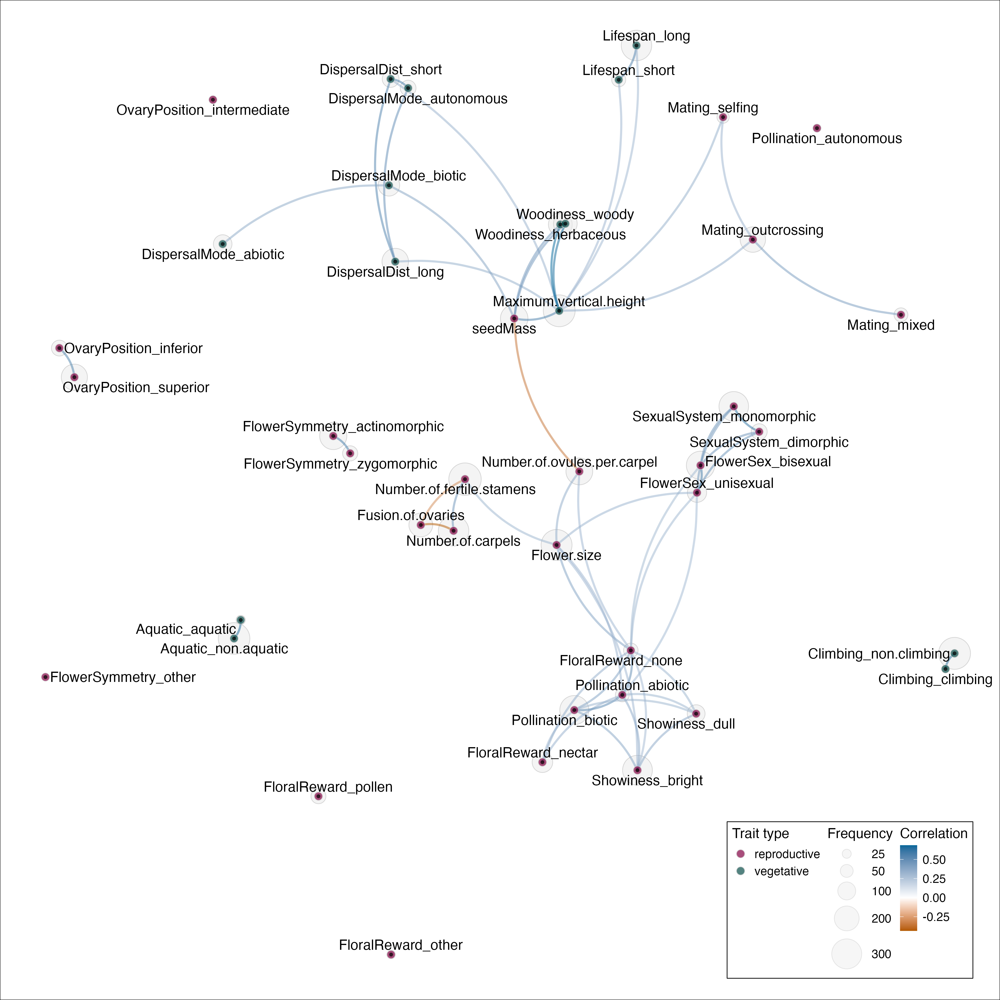
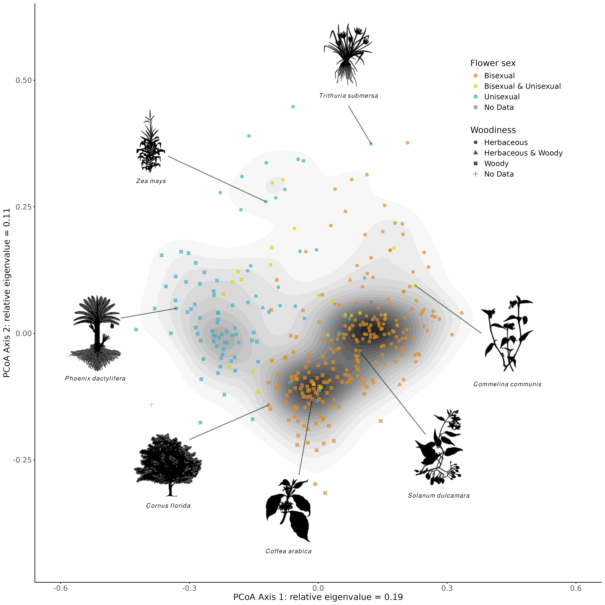
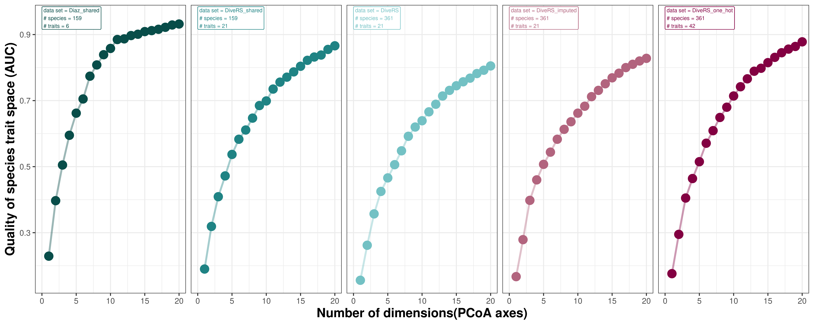
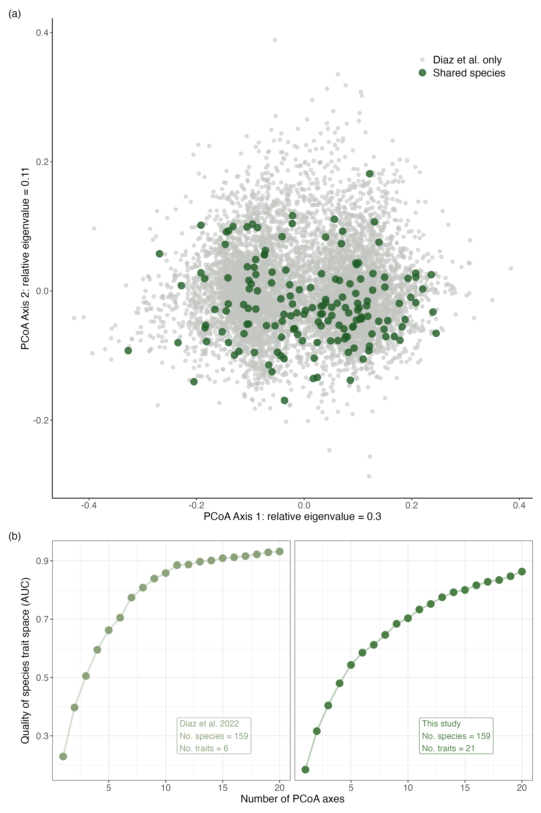
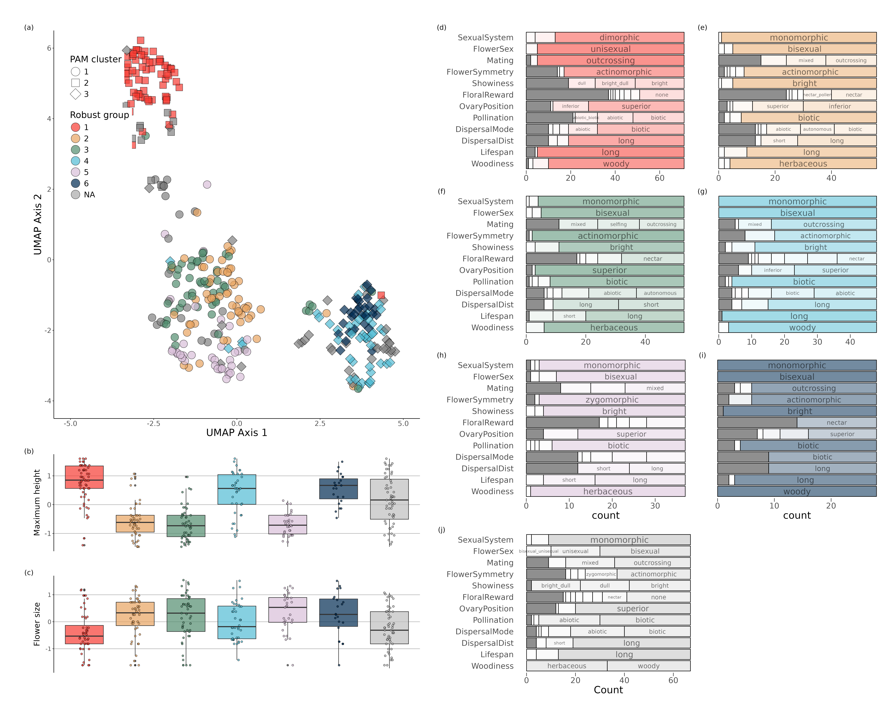
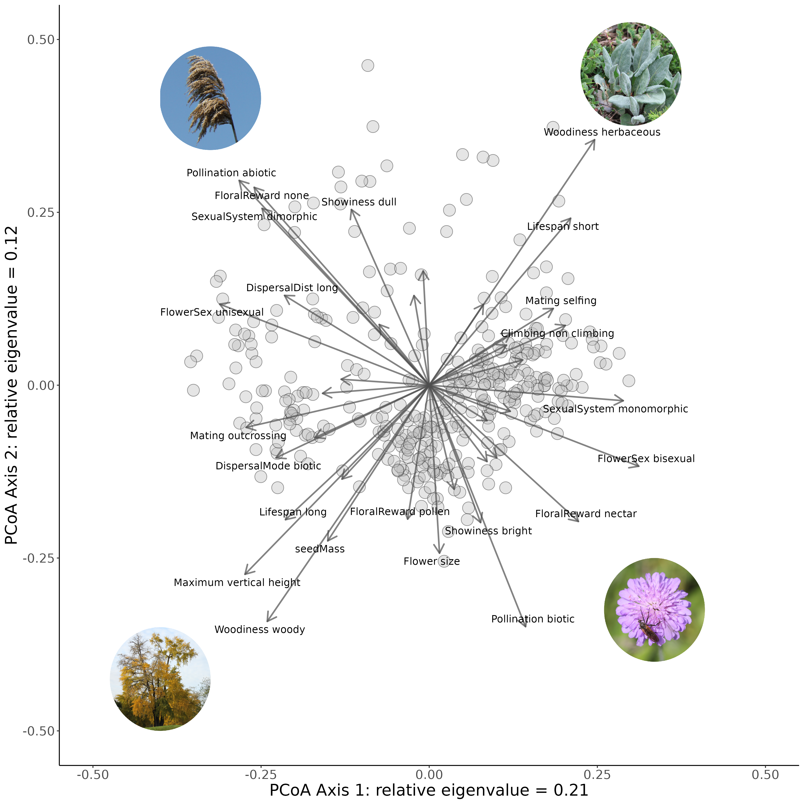
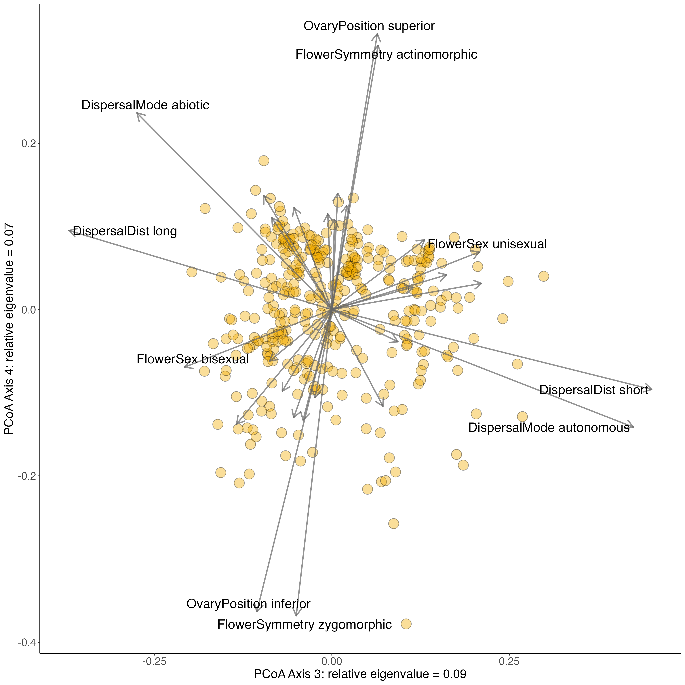
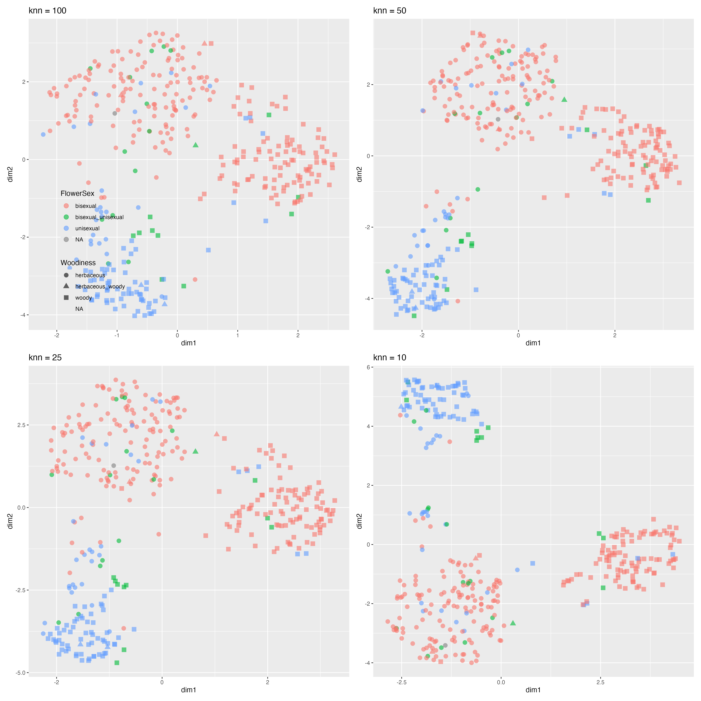
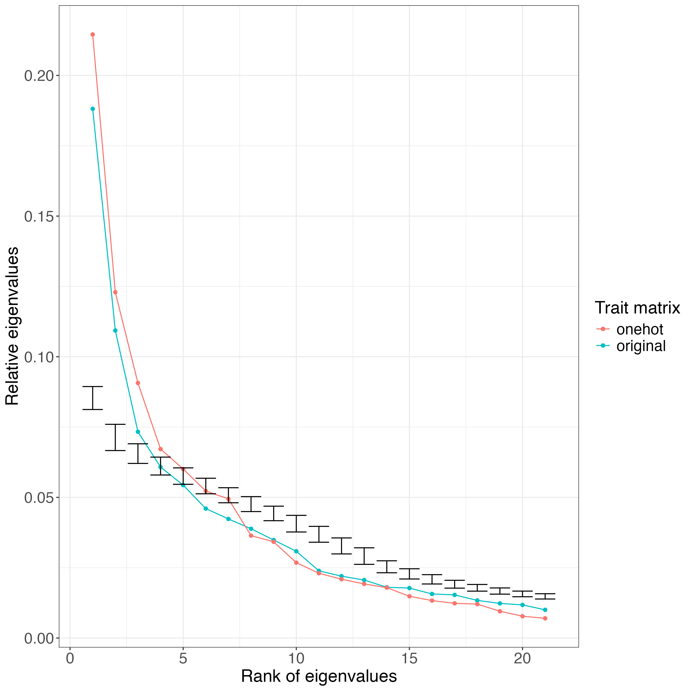
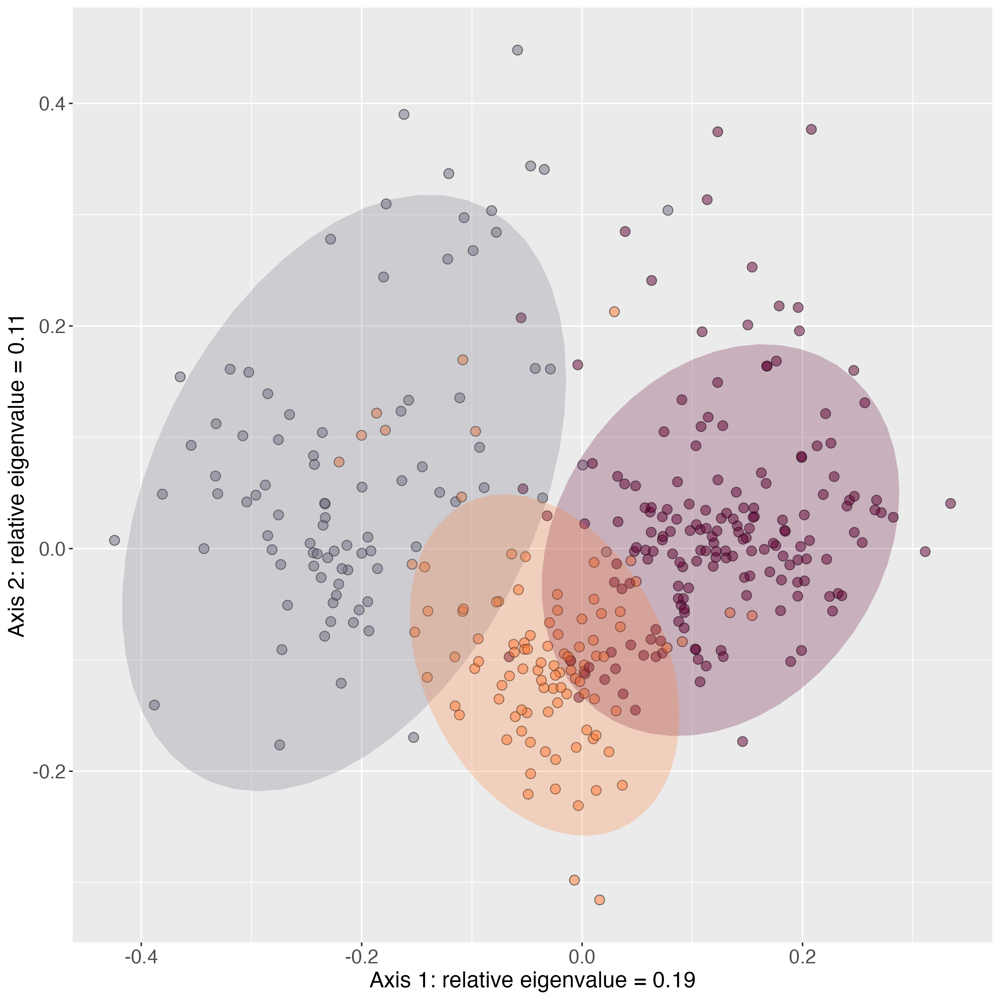

<!-- README.md is generated from README.Rmd. Please edit that file -->

```{r, include = FALSE}
knitr::opts_chunk$set(
  collapse  = TRUE,
  comment   = "#>",
  fig.path  = "man/figures/",
  out.width = "100%"
)
```

# Rcompendium for: Pollination and mating traits underlie diverse reproductive strategies in flowering plants

*A preprint can be found [here](https://doi.org/10.1101/2024.02.26.582019)*

### Content

This repository is structured as follow:

-   [`data/`](https://github.com/divers-it/rs-traitspace/tree/main/data):
    contains all raw data required to perform analyses

-   [`rscripts/`](https://github.com/divers-it/rs-traitspace/tree/main/rscripts/):
    contains R scripts to run each step of the workflow

-   [`outputs/`](https://github.com/divers-it/rs-traitspace/tree/main/outputs):
    contains all the results created during the workflow

-   [`figures/`](https://github.com/divers-it/rs-traitspace/tree/main/figures):
    contains all the figures created during the workflow

-   [`paper/`](https://github.com/divers-it/rs-traitspace/tree/main/paper):
    contains manuscript related content (biblio, templates, etc.)

-   [`R/`](https://github.com/divers-it/rs-traitspace/tree/main/R):
    contains R functions used in this project

-   [`man/`](https://github.com/divers-it/rs-traitspace/tree/main/man):
    contains help files of R functions

-   [`DESCRIPTION`](https://github.com/divers-it/rs-traitspace/tree/main/DESCRIPTION):
    contains project metadata (author, date, dependencies, etc.)

-   [`make.R`](https://github.com/divers-it/rs-traitspace/tree/main/make.R):
    master R script to run the entire project by calling each R script
    stored in the `rscripts/` folder

## Workflow

Note that there are two encodings that are used for these data. The original encoding has traits with as many values as there are states (e.g. woody, herbaceous, woody_herbaceous). For the one-hot encoding, each state is recoded to a binary trait (e.g. trait 1: woody, non-woody | trait 2: herbaceous, non-herbaceous). A number of scripts have corresponding one-hot encoding versions with the suffix "one_hot".

#### 1_proteus_data_preparation_discrete.R

Reads in raw PROTEUS data for all traits, then outputs a [table](https://github.com/divers-it/rs-traitspace/tree/main/outputs/all_states_per_trait.csv) of all states for each trait of interest. These are used to build the trait_recoding table, which is then reread into the script. The [trait_recoding](https://github.com/divers-it/rs-traitspace/tree/main/data/trait_recoding - Categorical to categorical.csv) table is then used to transform old PROTEUS states into new states that are more appropriate for analysis (in terms of reducing complexity or by making them more biologically interpretable). If traits are polymporphic for a species e.g. PROTEUS provides information indicating a species can be both woody and herbaceous this is coded by pasting the states together with an underscore ('woody_herbaceous').

```{r, echo=FALSE, results='asis'}
library(knitr)
tr<-read.csv("data/trait_recoding - Categorical to categorical.csv")
kable(tr[1:6,])
```

#### 2_proteus_data_preparation_quant.R

Reads in the same PROTEUS data as script 1 but this time prepares quantitative data for analysis. Values for quantitative traits found in PROTEUS are presented as data values (ValDat), data minimum values (MinDat) and data maximum values (MaxDat). As there may be multiple values per species, an average is taken for each of these data value types. If ValDat is present, this is used preferentially. If it is not present then the average of the averages of MaxDat and MinDat is used. A table with a single value per species is then exported.

#### 3_recode_quantitative_discrete.R

Converts quantitative variables to discrete ones. Values for outcrossing rates were converted from quantitative to discrete. If all rate values (MinDat, MaxDat, ValDat) were greater than 0.8 then the species was assigned 'outcrossing'. Likewise, if all rate values were less than 0.2 the species was assigned 'selfing'. Otherwise the species was classified as 'mixed'. Min and Max values were preferrentially used for assignment if available, if not the ValDat was used. This produces a table of discrete states. 

#### 4_merge_subset_data.R

Combines discrete, quantitative and discretized data into one data frame. Two sources of outcrossing information are present ('Mating' for the discrete assignment, 'outcrossing_rate' for the discretized assignment) and the discretized assignment is used preferentially if available. If Mating was polymorphic for a species (e.g. 'selfing_mixed') then it is recoded to 'mixed'. A new trait 'flowerSize' is made from the maximum value of flowerLength and flowerDiameter, which are then removed. A final table is output for downstream analysis.

#### 5_clean_filter_df.R

The dataset is then filtered, removing traits with more than 60% missing data and species with more than 50% missing data. Outliers for each of the traits are also removed and the data is saved as an RDS.

{width=800px}

#### 6_scale_transform.R

The data set is read in and scaled, histograms of the variables for each trait are plotted and log-transformed if appropriate. The data is saved as an RDS.

```{r, echo=FALSE, results='asis'}
library(knitr)
tr<-readRDS(file = here::here("outputs/6_df_filt_trans.rds"))
kable(tr[1:6,])
```

#### 7_correlation.R

Examines the correlation between traits in the dataset.

{width=800px}

#### 8.0_pcoa.R

Gower's [distance](https://medium.com/analytics-vidhya/gowers-distance-899f9c4bd553) is calculated among species as it can deal with quantitative, qualitative and missing trait data.

Principal coordinate analysis ([PCOA](https://en.wikipedia.org/wiki/Multidimensional_scaling#Types)) based on Gower's distances previously calculated. Here are all species displayed on the first two PCOA axes. 

{width=800px}

#### 9_dimensionality_analyses.R

To get an idea of the quality of the trait space, analyses from [Mouillot & Loiseau et al. 2021](https://onlinelibrary.wiley.com/doi/abs/10.1111/ele.13778) were run: *To assess the dimensionality and robustness of species trait spaces, we needed a metric measuring the degree of distortion between the initial trait distance matrix between species pairs (Gower distance on all traits) and the distance matrix after dimensionality reduction (Euclidean distance on PCoA axes) or after removing traits (Gower distance on the sub-selection of traits), respectively. We assumed that a trait space is a high- quality representation of the full dataset if distances between species in that space are close to the initial distances computed with all traits (Maire et al., 2015).*

The plot below shows how the quality of the trait space increases as dimensions or PCoA axes are added. The elbow technique is used to show where adding more axes starts having less of an effect on trait space quality. This is quite early for our dataset, around 0.4 AUC suggesting that these do not adequately represent the original trait space and more axes are needed to do so. The dataset does pass the AUC threshold of 0.7 within 20 axes indicating that when a larger number of axes are considered the reduced trait space is a good representation.

{width=600px}

#### 8.1_pcoa_diaz_data.R

We examined to locations of our species in the trait space derived from classical plant functional traits [Diaz et al. 2022](https://doi.org/10.1038/s41597-022-01774-9), and compared the quality of these trait spaces.

{width=600px}

#### 10_clustering_PAM.R

The [Partitioning Around Medoids](https://dpmartin42.github.io/posts/r/cluster-mixed-types) (PAM) approach is used. All species must be assigned to a cluster and some species may be spuriously assigned to clusters. To avoid interpreting species than are not well-clustering we look at 'robust groups' - those species that consistently stick together as the value of k is changed. A [`Sankey plot`](https://github.com/divers-it/rs-traitspace/tree/main/figures/10_sankey_pam.html) demonstrates how species move between clusters as k is increased. 

We can then visualize how these robust groups relate to clusters, and also how traits differ among robust groups.

{width=600px}

#### 11_functional_space_mfd.R

To compare groups within a data set we use the package [mfd](https://onlinelibrary.wiley.com/doi/pdf/10.1111/ecog.05904). To get an idea of the variation within different groups we can calculate different alpha functional diversity indices. For example, we can compare various functional diversity indices among PAM clusters (k = 3).

```{r, echo=FALSE, results='asis'}
library(knitr)
tr<-read.csv(file = here::here("outputs/11_mfd_indices_PAM_k3.csv"))
kable(tr)
```

#### 12_phylo_plot

Plots a phylogenetic tree of all 360 species in our data set. 

{width=600px}

#### one_hot_13_loadings.R

Builds a traitspace using one-hot encoded data. Eigenvectors are plotted on the first two axes, similar to 'loadings' from a PCA biplot. 

{width=600px}

We can also examine other axes to see which traits vary along them.

{width=600px}

#### 14_UMAP.R

Performs Uniform Manifold Approximation and Projection (UMAP), a non-linear dimensionality reduction approach. 

{width=600px}

Also systematically plots all traits on [`umap`](https://github.com/divers-it/rs-traitspace/tree/main/figures/umap) and [`pcoa`](https://github.com/divers-it/rs-traitspace/tree/main/figures/pcoa) trait spaces. 

#### 15_simulations.R

Fits models of trait evolution to each trait, and then uses these along phylogenetic trees to simulate 1000 data sets. PCoA is run on these simulated data sets and results are compared to empirical ones.

{width=600px}

## Supplementary scripts

#### 10.1_clustering_kprototype.R

[k-prototypes](https://journal.r-project.org/archive/2018/RJ-2018-048/RJ-2018-048.pdf) clustering, another method than can deal with missing and mixed-type data.

#### 10.2_clustering_hierarchical.R

This script is based on an online [tutorial](https://towardsdatascience.com/hierarchical-clustering-on-categorical-data-in-r-a27e578f2995) that uses the hierarchical clustering approach to create clusters based on Gower's distances. 

From **hclust** help: *Ward's minimum variance method aims at finding compact, spherical clusters. The complete linkage method finds similar clusters. The single linkage method (which is closely related to the minimal spanning tree) adopts a ‘friends of friends’ clustering strategy. The other methods can be regarded as aiming for clusters with characteristics somewhere between the single and complete link methods.*

{width=400px}

## Utility scripts

#### collate_clustering_results.R

Brings together the clustering results from different approaches (including one-hot encoding).

#### gawdis.R

Examines the effect of different weighting when calculating distances matrices.

#### generate_phylo.R

Builds phylogenetic tree using our species list.

#### get_taxonomy.R

Searches species names against the world checklist of vascular plants, and corrections are made where necessary.

#### impute_missing_data.R

Uses random forests and the phylogenetic tree to infer missing data.

#### nmds.R

Non-metric multidimensional scaling is an alternative approach to visualizing trait spaces.

#### remove_dioecious_species_test.R

Examining the effect of randomly removing dioecious species, which are overrepresented in the data set. 

#### sankey_between_methods.R

Examines how clusters compare across different clustering approaches.

#### test_robust_groups.R

Assessing how changing the minimum / maximum k values affects robust group classification.

#### trait_selection.R

Several approaches to determine which traits capture the most variation in the data set. 

