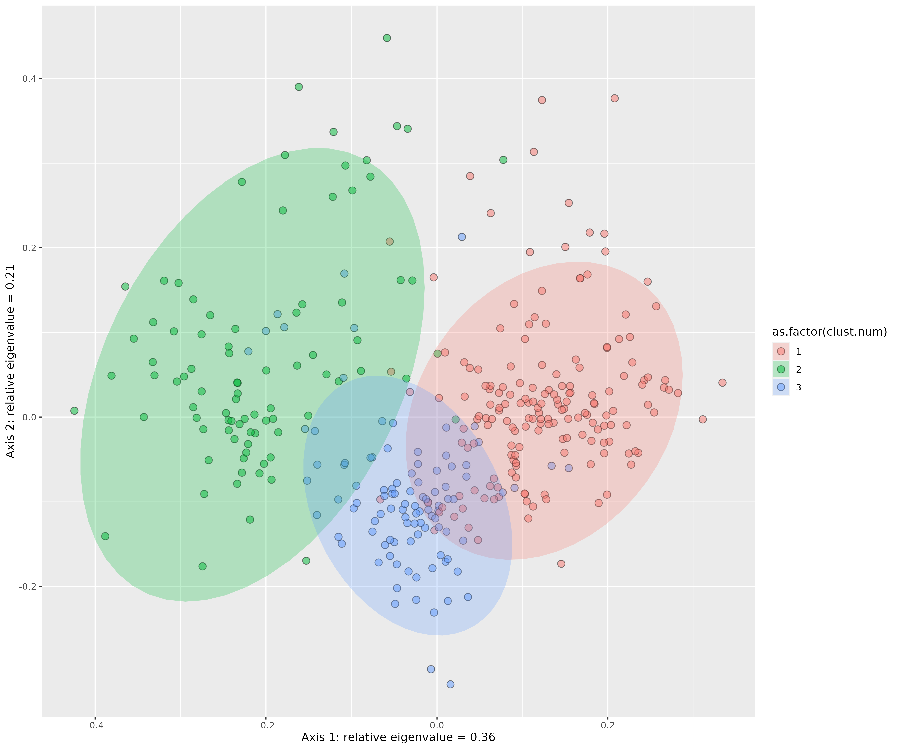
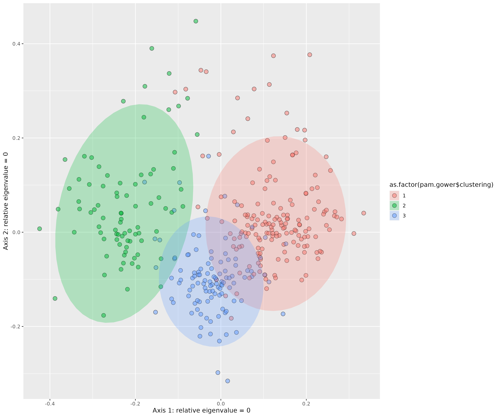

<!-- README.md is generated from README.Rmd. Please edit that file -->

```{r, include = FALSE}
knitr::opts_chunk$set(
  collapse  = TRUE,
  comment   = "#>",
  fig.path  = "man/figures/",
  out.width = "100%"
)
```

# divers-tree

### Content

This repository is structured as follow:

-   [`data/`](https://github.com/mvallejo6/divers-tree/tree/master/data):
    contains all raw data required to perform analyses

-   [`rscripts/`](https://github.com/mvallejo6/divers-tree/tree/master/rscripts/):
    contains R scripts to run each step of the workflow

-   [`outputs/`](https://github.com/mvallejo6/divers-tree/tree/master/outputs):
    contains all the results created during the workflow

-   [`figures/`](https://github.com/mvallejo6/divers-tree/tree/master/figures):
    contains all the figures created during the workflow

-   [`paper/`](https://github.com/mvallejo6/divers-tree/tree/master/paper):
    contains all the manuscript and related content (biblio, templates,
    etc.)

-   [`R/`](https://github.com/mvallejo6/divers-tree/tree/master/R):
    contains R functions developed especially for this project

-   [`man/`](https://github.com/mvallejo6/divers-tree/tree/master/man):
    contains help files of R functions

-   [`DESCRIPTION`](https://github.com/mvallejo6/divers-tree/tree/master/DESCRIPTION):
    contains project metadata (author, date, dependencies, etc.)

-   [`make.R`](https://github.com/mvallejo6/divers-tree/tree/master/make.R):
    master R script to run the entire project by calling each R script
    stored in the `rscripts/` folder

-   [`make_one_hot.R`](https://github.com/mvallejo6/divers-tree/tree/master/make_one_hot.R):
    modified master R script to run certain scripts with one-hot encoded data, 
    allowing trait loading to be plotted in the PCOA plot (including preliminary 3D plot)

## To do:

-   How many polymorphisms per each trait (old and new)
-   What are unique states/state combinations per trait
-   what each analysis is doing in readme
-   implement the ordinal traits: (1) to take into account
    polymorphy, (2) to start with 'old' PROTEUS traits and order them
    based on what's in the data, including polymorphisms

## Notes

-   Don't impute missing data that is missing for a natural reason

-   Hypervolumes to deal with complex trait spaces :
    <https://www.pnas.org/doi/10.1073/pnas.1317722111>

-   phylo PCA does not work well :
    <https://academic.oup.com/sysbio/article/64/4/677/1649888>

-   ASR coevolution :
    <https://www.biorxiv.org/content/10.1101/2021.09.03.458928v2.full.pdf+html>

-   Pagel made the "best model" :
    <https://www.nature.com/articles/s41467-022-28595-z>

-   Macroevolution and function traits in birds
    <https://www.nature.com/articles/s41559-019-1070-4>

-   Suggested at FREE workshop that ordinal vars generally give better
    trait space quality so try to use those

-   Functional distance between some species is equal to 0. You can
    choose to gather species into Functional Entities gathering species
    with similar traits values.

-   If things are bright/whitish and dull, delete dull

-   why is NA in the mfd faxes plots? (correlations)

Using mfd to compare trait spaces

-   Are dimorphic species functionally less diverse than monomorphic
    species
-   Are reproductive strategies of trees more diverse than those of
    herbs?

This would involve removing e.g. reproductive traits or woodiness from
the dataset, but would we also have to remove correlated traits like
tree height?

-   Look for unexpected correlations

-   What about the gaps in trait space? where are dimorphic species
    lacking?

## Workflow

### 1_proteus_data_preparation_discrete.R

Reads in raw PROTEUS data for all traits, then outputs a [table](https://github.com/mvallejo6/divers-tree/tree/master/outputs/all_states_per_trait.csv) of all states for each trait of interest. These are used to build the trait_recoding table (https://docs.google.com/spreadsheets/d/14ITGqVvyfYeVSVSzbrWe9eUWF4NXO7cZvtZDk5mlTW0/edit?usp=sharing), which is then reread into the script. The [trait_recoding](https://github.com/mvallejo6/divers-tree/tree/master/data/trait_recoding - Categorical to categorical.csv) table is then used to transform old PROTEUS states into new states that are more appropriate for analysis (in terms of reducing complexity or by making them more biologically interpretable). If traits are polymporphic for a species e.g. PROTEUS provides information indicating a species can be both woody and herbaceous this is coded by pasting the states together with an underscore ('woody_herbaceous').

```{r, echo=FALSE, results='asis'}
library(knitr)
tr<-read.csv("data/trait_recoding - Categorical to categorical.csv")
kable(tr[1:6,])
```

### 2_proteus_data_preparation_quant.R

Reads in the same PROTEUS data as script 1 but this time prepares quantitative data for analysis. Values for quantitative traits found in PROTEUS are presented as data values (ValDat), data minimum values (MinDat) and data maximum values (MaxDat). As there may be multiple values per species, an average is taken for each of these data value types. If ValDat is present, this is used preferentially. If it is not present then the average of the averages of MaxDat and MinDat is used. A [table](https://github.com/mvallejo6/divers-tree/tree/master/outputs/proteus_quantitative.csv) with a single value per species is then exported.

### 3_recode_quantitative_discrete.R

Converts quantitative variables to discrete ones. Values for outcrossing rates were converted from quantitative to discrete. If all rate values (MinDat, MaxDat, ValDat) were greater than 0.8 then the species was assigned 'outcrossing'. Likewise, if all rate values were less than 0.2 the species was assigned 'selfing'. Otherwise the species was classified as 'mixed'. Min and Max values were preferrentially used for assignment if available, if not the ValDat was used. This produces a [table](./outputs/proteus_quant_recoded.csv) of discrete states. 

### 4_merge_subset_data.R

Combines discrete, quantitative and discretized data into one data frame. Two sources of outcrossing information are present ('Mating' for the discrete assignment, 'outcrossing_rate' for the discretized assignment) and the discretized assignment is used preferentially if available. If Mating was polymorphic for a species (e.g. 'selfing_mixed') then it is recoded to 'mixed'. A new trait 'flowerSize' is made from the maximum value of flowerLength and flowerDiameter, which are then removed. A final [table](https://github.com/mvallejo6/divers-tree/tree/master/outputs/proteus_combined.csv) is output for downstream analysis.

### 5_clean_filter_df.R

The amount of missing data in the dataset is visualized with a missingness plot. 

{width=800px}

The dataset is then filtered, removing traits with more than 60% missing data and species with more than 50% missing data. Outliers for each of the traits are also removed and the data is saved as an [RDS](https://github.com/mvallejo6/divers-tree/tree/master/outputs/df_filt.rds).

### 6_scale_transform.R

The dataset is read in and scaled, histograms of the variables for each trait are [plotted](https://github.com/mvallejo6/divers-tree/tree/master/figures/proteus_trait_hists.pdf) and [log-transformed](https://github.com/mvallejo6/divers-tree/tree/master/figures/proteus_trait_hists_transformed.pdf) if appropriate. The data is saved as an [RDS](https://github.com/mvallejo6/divers-tree/tree/master/outputs/df_filt_trans.rds).

```{r, echo=FALSE, results='asis'}
library(knitr)
tr<-readRDS(file = here::here("outputs/df_filt_trans.rds"))
kable(tr[1:6,])
```

### 7_correlation.R

Examines the correlation between traits in the dataset. First Kendall's [distance](https://en.wikipedia.org/wiki/Kendall_tau_distance) (a ranked metric) is calculated pairwise among each trait. Traits are plotted pairwise to examine their relationships visually. [DESCRIBE]

{width=2000px}

Gower's [distance](https://medium.com/analytics-vidhya/gowers-distance-899f9c4bd553) is calculated among species as it can deal with quantitative, qualitative and missing trait data.

{width=800px}

### 8_pcoa.R

Principal coordinate analysis ([PCOA](https://en.wikipedia.org/wiki/Multidimensional_scaling#Types)) based on Gower's distances previously calculated. Here are all species displayed on the first two PCOA axes. 

{width=400px}

The relative eigenvalues indicate the proportion of variation each axis explains.

{width=400px}

The PCOA can also be plotted alongside different traits. 

{width=800px}

The script [8.1_pcoa_no_reproductive.R](https://github.com/mvallejo6/divers-tree/tree/master/rscripts/8.1_pcoa_no_reproductive.R) repeats the same PCOA but builds the trait space without reproductive traits ('Mating','SexualSystem','FlowerSex'). This can then be plotted and coloured by the reproductive traits that were removed to see how they are distributed in the trait space.

{width=800px}

### 9_dimensionality_analyses.R

To get an idea of the quality of the trait space, analyses from [Mouillot & Loiseau et al.](https://onlinelibrary.wiley.com/doi/abs/10.1111/ele.13778) were run: *To assess the dimensionality and robustness of species trait spaces, we needed a metric measuring the degree of distortion between the initial trait distance matrix between species pairs (Gower distance on all traits) and the distance matrix after dimensionality reduction (Euclidean distance on PCoA axes) or after removing traits (Gower distance on the sub-selection of traits), respectively. We assumed that a trait space is a high- quality representation of the full dataset if distances between species in that space are close to the initial distances computed with all traits (Maire et al., 2015).*


The plot below shows how the quality of the trait space increases as dimensions or PCoA axes are added. The elbow technique is used to show where adding more axes starts having less of an effect on trait space quality. This is quite early for our dataset, around 0.4 AUC suggesting that these do not adequately represent the original trait space and more axes are needed to do so. The dataset does pass the AUC threshold of 0.7 within 20 axes indicating that when a larger number of axes are considered the reduced trait space is a good representation.

{width=600px}

When we examine the effect of trait omission we find that removing just 10% of the traits has a drastic effect on AUC (which as I understand starts at 1), losing almost 50%. This suggests that trait removal done above to plot reproductive characteristics might not be the best idea.

{width=600px}

The trait space itself is then plotted and singletons, those species that are unique in the trait space, are shown as dark circles. In our case the trait space seems relatively uniform with few real outliers. There appears to be three major groups of points.

{width=600px}

### 10_functional_space_mfd.R

The dimensionality approach was adapted from a paper that aimed to compare different datasets. To better make comparisons within a single dataset we can again examine the functional space, but this time with the package [mfd](https://onlinelibrary.wiley.com/doi/pdf/10.1111/ecog.05904). This approach is a little more black box but also more intuitive. We start by assessing the appropriate number of PCoA axes to retain, as above. The table below shows the number of axes and the quality (MAD), indcating that six dimensions may be the most appropriate (as opposed to four above).

```{r, echo=FALSE, results='asis'}
library(knitr)
tr<-read.csv(file = here::here("outputs/mfd_qual.csv"))
kable(tr[1:10,])
```
With the mFD package, it is possible to illustrate the quality of PCoA-based multidimensional spaces according to deviation between trait-based distances and distances in the functional space. This function generates a figure with three panels (in rows) for each selected functional space (in columns).  The x-axis of all panels represents trait-based distances. The y-axis is different for each row:

* on the first (top) row, the y-axis represents species functional distances in the multidimensional space. Thus, the closer species are to the 1:1 line, the better distances in the functional space fit trait-based ones
* on the second row, the y-axis shows the raw deviation of species distances in the functional space compared to trait-based distances. Thus, the raw deviation reflects the distance to the horizontal line.
* on the third row (bottom), the y-axis shows the absolute or squared deviation of the (“scaled”) distance in the functional space. It is the deviation that is taken into account for computing the quality metric.

{width=1000px}
mFD allows to test for correlations between traits and functional axes and then illustrate possible correlations

* continuous traits = linear model is computed and r2 and associated p-value are returned
* non-continuous traits = Kruskal-Wallis test is computed and eta2 statistic is returned

{width=1000px}

{width=1000px}

{width=1000px}

We can then visualize the functional space across the first four axes.

{width=1000px}

To get an idea of the variation within different groups we can calculate different alpha functional diversity indices. We first looked at this comparing different angiosperm groups.

```{r, echo=FALSE, results='asis'}
library(knitr)
tr<-read.csv(file = here::here("outputs/mfd_ind_values.csv"))
kable(tr)
```

We found that dicots had a larger functional richness than monocots.

{width=1000px}

But functional divergence remained similar as species were relatively evenly distributed in the trait space (e.g. not clustered near the centre).

{width=1000px}

The Functional Distinctiveness of a species is the average functional distance from a species to all the other in the given community. 

{width=600px}

Functional Uniqueness represents how "isolated" is a species in the global species pool, it is the functional distance to the nearest neighbor of the species of interest.

{width=600px}

### 11_clustering_hierarchical.R

This script is based on an online [tutorial](https://towardsdatascience.com/hierarchical-clustering-on-categorical-data-in-r-a27e578f2995) that uses the hierarchical clustering approach to create clusters based on Gower's distances. First dendrograms are built using several different methods including divisive and agglomerative clustering. Within agglomerative clustering five different methods are used to create dendrograms. 

From **hclust** help: *Ward's minimum variance method aims at finding compact, spherical clusters. The complete linkage method finds similar clusters. The single linkage method (which is closely related to the minimal spanning tree) adopts a ‘friends of friends’ clustering strategy. The other methods can be regarded as aiming for clusters with characteristics somewhere between the single and complete link methods.*

{width=800px}

To understand the appropriate number of clusters for the data and method, a [helper script](https://github.com/mvallejo6/divers-tree/tree/master/R/cstats.table.R) is used to provide some statistics about the qualities of different clusters, up to seven. 

```{r, echo=FALSE, results='asis'}
library(knitr)
tr<-read.csv(file = here::here("outputs/stats_hclust_ward.csv"))
kable(tr)
```

'within.cluster.ss' or within-cluster sum of squares is a measure of closeness of observations : the lower it is the closer the observations within the clusters are — changes for the different number of clusters.

'average.within' is an average distance among observations within clusters
'average.between' is an average distance among observations between clusters
'wb.ratio' is the ratio between these two averages.

'dunn2' is the dunn index, which can be [interpreted](https://www.datanovia.com/en/lessons/cluster-validation-statistics-must-know-methods/#silhouette-coefficient) as follows: If the data set contains compact and well-separated clusters, the diameter of the clusters is expected to be small and the distance between the clusters is expected to be large. Thus, Dunn index should be maximized.

'avg.silwidth' can be [defined](https://www.datanovia.com/en/lessons/cluster-validation-statistics-must-know-methods/#silhouette-coefficient) as follows: Observations with a large values (almost 1) are very well clustered, small (around 0) means that the observation lies between two clusters. Observations with a negative Si are probably placed in the wrong cluster. The average is taken across all observations (species) in each cluster.

The remaining rows indicate the number of species in each cluster, this shouldn't be too skewed ideally. The Ward method (table presented above) provides the best *within.cluster.ss* and a relatively even distribution of cluster sizes compared to other methods so we proceed with this approach.

Then the appropriate number of clusters must be chosen using these statistics. The elbow method examines how a statistic changes with the number of clusters, looking for when adding more clusters stops substantially improving the clustering. In this case it is quite difficult to identify the elbow, perhaps three or six clusters are the most appropriate.

{width=400px}

Silhouette width can also be used in a similar way, but seems to prefer two clusters in most situations so is perhaps less reliable.

{width=400px}

Once a number of clusters can be selected this can be visualised on the dendrogram.


```{r echo=FALSE, fig.cap = "Fig. Ward dendrogram coloured by clusters (k = 3 and k = 6)"}
knitr::include_graphics("./figures/dendro_ward_k3_k6.png")
```

We can then examine the trait states and values that make up each cluster.


{width=600px}


```{r echo=FALSE, fig.cap = "Fig. Values of  quantitative traits across clusters (k = 3)"}
knitr::include_graphics("./figures/hclust_characteristics_quant.png")
```

* Cluster 1 is made up of small herbaceous, monomorphic (and bisexual) species with large, bright flowers. Species examples include *Curcurbita pepo*, *Geranium sanguineum* and *Nicotiana tabacum*.

* Cluster 2 contains species that are long lived, biotically pollinated outcrossers that are unisexual and actinomorphic. Their flowers tend to be small with low numbers of ovules per functional carpel. Species examples include *Allium sativum*, *Populus alba* and *Amborella trichopoda*.

* Cluster 3 harbors species that are woody, monomorphic (and bisexual) that are tall with large flowers containing many fertile stamens. Species examples include *Viburnum rufidulum*, *Coffea arabica* and *Ravenala madagascariensis*.

We can then represent the identified clusters on the PCOA trait space. 

```{r echo=FALSE, fig.cap = "Fig. PCOA plot coloured by clusters (k = 3)"}

```

Six clusters was also an option but when visualized in the 2d trait space they seem less neat.

```{r echo=FALSE, fig.cap = "Fig. PCOA plot coloured by clusters (k = 6)"}
knitr::include_graphics("./figures/pcoa_hclust_k6.png")
```


### 11.1_clustering_kprototype.R

Other methods that can deal with mixed and missing data include [kprototypes](https://journal.r-project.org/archive/2018/RJ-2018-048/RJ-2018-048.pdf), which yields results similar to hierarchical clustering.

```{r echo=FALSE, fig.cap = "Fig. PCOA plot coloured by clusters from the kprototypes approach (k = 4)"}
knitr::include_graphics("./figures/pcoa_kproto_k4.png")
```

### 11.2_clustering_PAM.R

Likewise the [Partitioning Around Medoids](https://dpmartin42.github.io/posts/r/cluster-mixed-types) (PAM) approach also found similar clustering.

```{r echo=FALSE, fig.cap = "Fig. PCOA plot coloured by clusters from the PAM approach (k = 3)"}

```

### 11.3_clustering_LCM.R

Another potential approach is [model-based clustering](https://varsellcm.r-forge.r-project.org/) but this generated results quite different to the others. Perhaps due to a more dominant influence of quantitative characters.

```{r echo=FALSE, fig.cap = "Fig. PCOA plot coloured by clusters from model-based clustering (k = 3)"}
knitr::include_graphics("./figures/pcoa_LCM_k3.png")
```

## Other scripts

### discrete_state_freqs.R

The number of species with each discrete state (original) from the
PROTEUS dataset.
