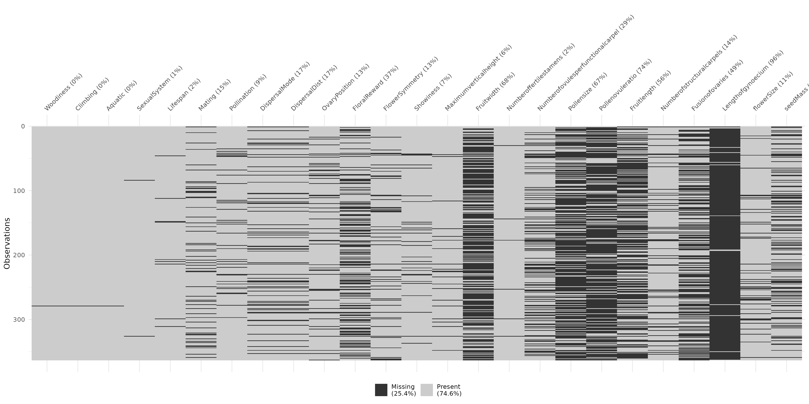
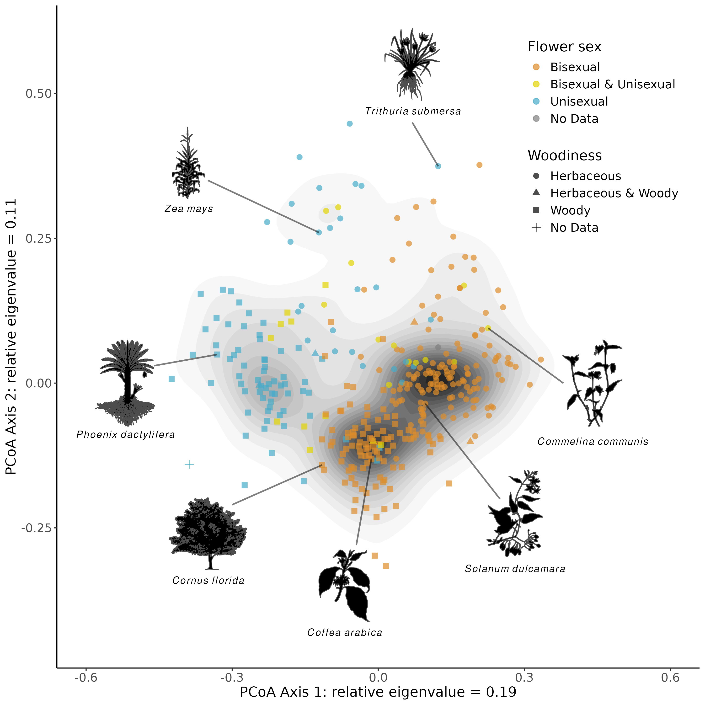
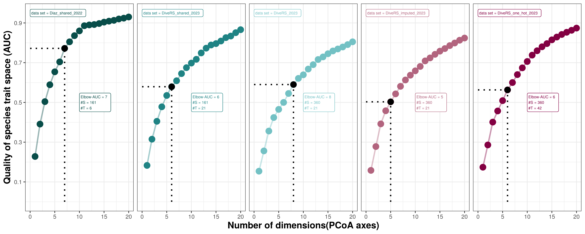
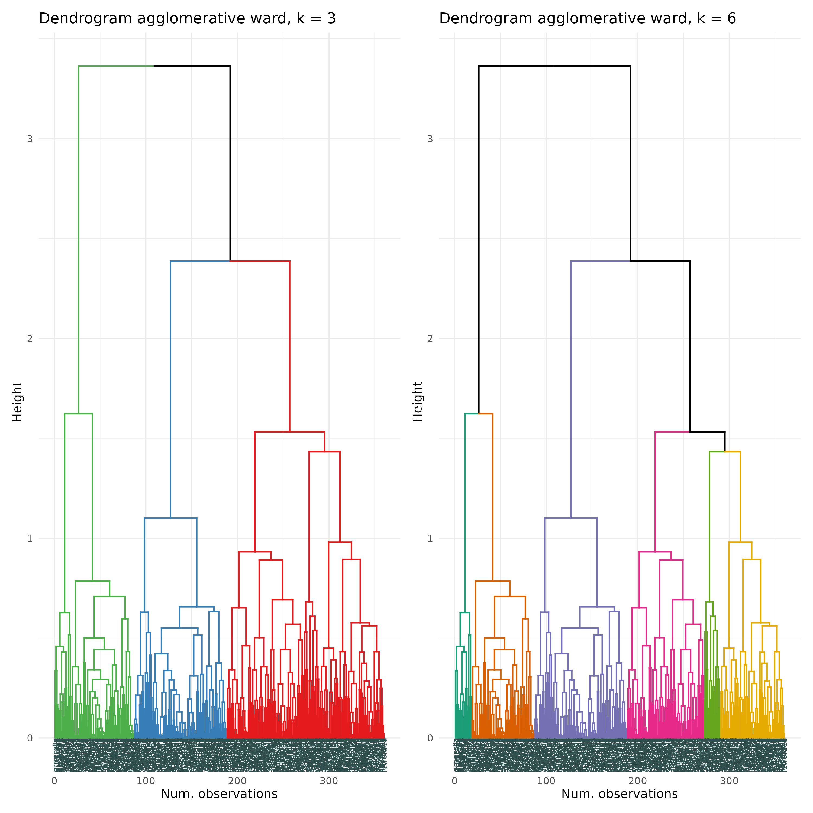
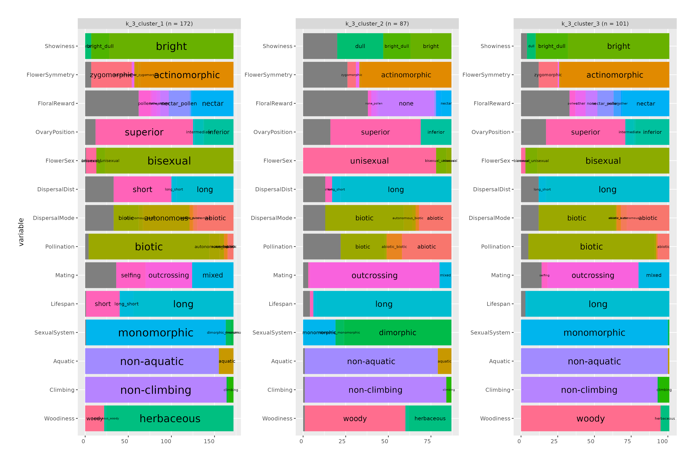
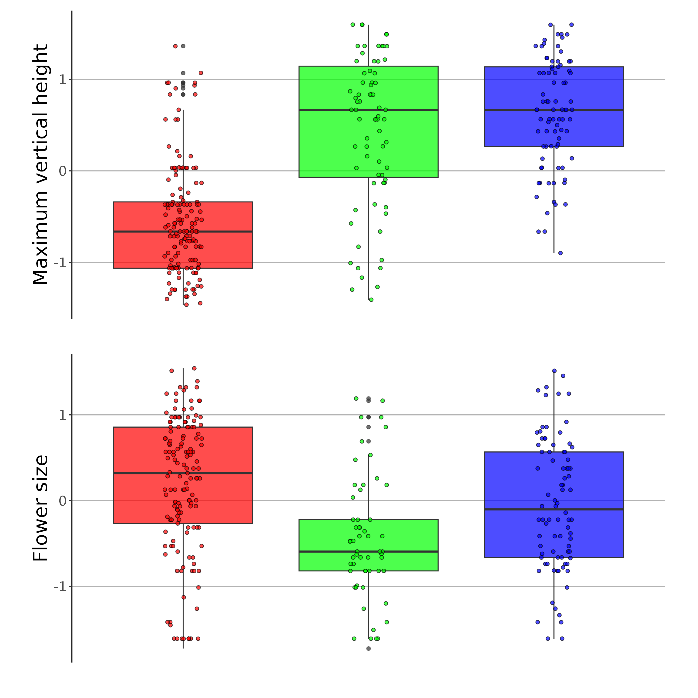
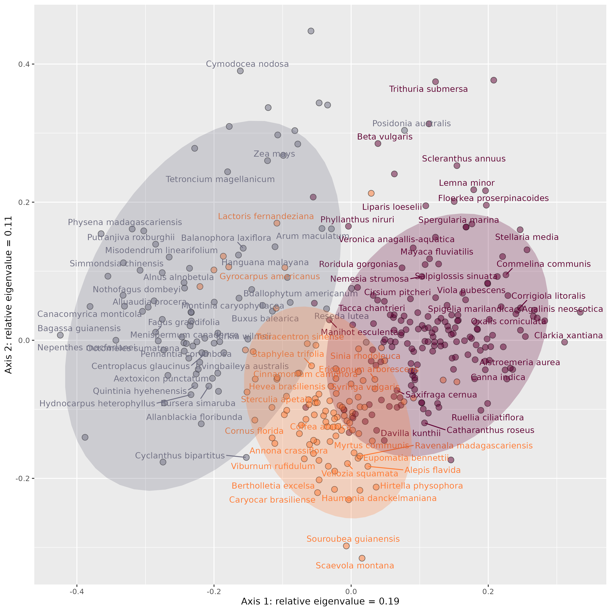
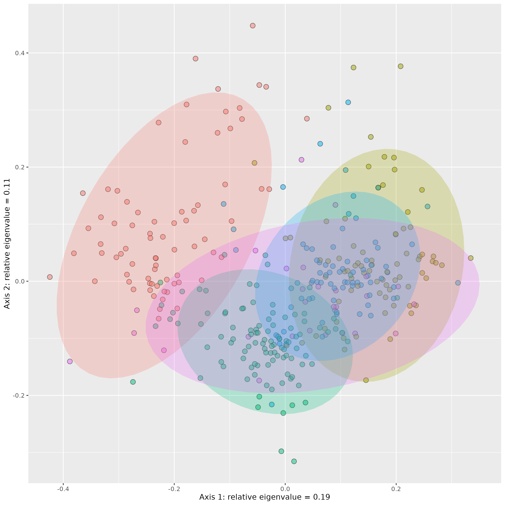
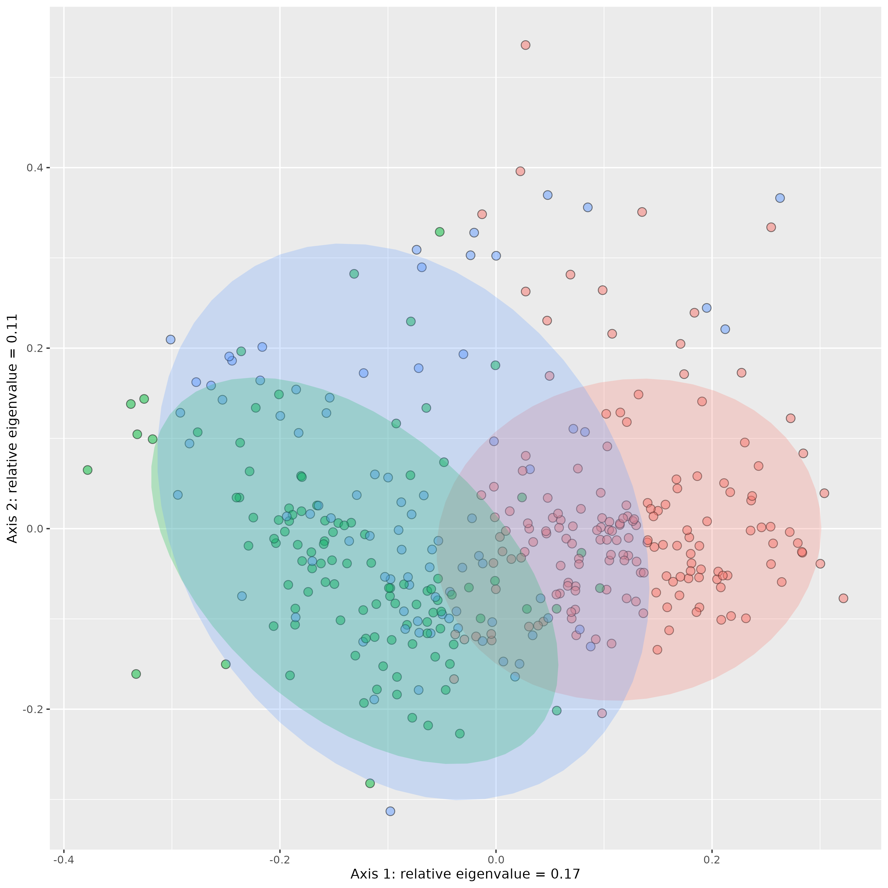

<!-- README.md is generated from README.Rmd. Please edit that file -->

# divers-tree

### Content

This repository is structured as follow:

- [`data/`](https://github.com/divers-it/rs-traitspace/tree/main/data):
  contains all raw data required to perform analyses

- [`rscripts/`](https://github.com/divers-it/rs-traitspace/tree/main/rscripts/):
  contains R scripts to run each step of the workflow

- [`pythonscripts/`](https://github.com/divers-it/rs-traitspace/tree/main/pythonscripts/):
  contains python scripts relevant to the workflow

- [`outputs/`](https://github.com/divers-it/rs-traitspace/tree/main/outputs):
  contains all the results created during the workflow

- [`pres_files/`](https://github.com/divers-it/rs-traitspace/tree/main/pres_files):
  contains files associated wth the pres.qmd

- [`figures/`](https://github.com/divers-it/rs-traitspace/tree/main/figures):
  contains all the figures created during the workflow

- [`paper/`](https://github.com/divers-it/rs-traitspace/tree/main/paper):
  contains all the manuscript and related content (biblio, templates,
  etc.)

- [`R/`](https://github.com/divers-it/rs-traitspace/tree/main/R):
  contains R functions developed especially for this project

- [`man/`](https://github.com/divers-it/rs-traitspace/tree/main/man):
  contains help files of R functions

- [`DESCRIPTION`](https://github.com/divers-it/rs-traitspace/tree/main/DESCRIPTION):
  contains project metadata (author, date, dependencies, etc.)

- [`make.R`](https://github.com/divers-it/rs-traitspace/tree/main/make.R):
  master R script to run the entire project by calling each R script
  stored in the `rscripts/` folder

## Workflow

### 1_proteus_data_preparation_discrete.R

Reads in raw PROTEUS data for all traits, then outputs a
[table](https://github.com/divers-it/rs-traitspace/tree/main/outputs/all_states_per_trait.csv)
of all states for each trait of interest. These are used to build the
trait_recoding table
(<https://docs.google.com/spreadsheets/d/14ITGqVvyfYeVSVSzbrWe9eUWF4NXO7cZvtZDk5mlTW0/edit?usp=sharing>),
which is then reread into the script. The
[trait_recoding](https://github.com/divers-it/rs-traitspace/tree/main/data/trait_recoding%20-%20Categorical%20to%20categorical.csv)
table is then used to transform old PROTEUS states into new states that
are more appropriate for analysis (in terms of reducing complexity or by
making them more biologically interpretable). If traits are polymporphic
for a species e.g. PROTEUS provides information indicating a species can
be both woody and herbaceous this is coded by pasting the states
together with an underscore (‘woody_herbaceous’).

| trait_number | old_trait  | old_state          | old_state_freq | new_trait | new_state  |
|-------------:|:-----------|:-------------------|---------------:|:----------|:-----------|
|            1 | Habit (D1) | \(0\) tree         |            109 | Woodiness | woody      |
|            1 | Habit (D1) | \(1\) shrub        |             89 | Woodiness | woody      |
|            1 | Habit (D1) | \(2\) liana        |              7 | Woodiness | woody      |
|            1 | Habit (D1) | \(3\) herb         |            141 | Woodiness | herbaceous |
|            1 | Habit (D1) | \(4\) vine         |             11 | Woodiness | herbaceous |
|            1 | Habit (D1) | \(5\) aquatic herb |             26 | Woodiness | herbaceous |

### 2_proteus_data_preparation_quant.R

Reads in the same PROTEUS data as script 1 but this time prepares
quantitative data for analysis. Values for quantitative traits found in
PROTEUS are presented as data values (ValDat), data minimum values
(MinDat) and data maximum values (MaxDat). As there may be multiple
values per species, an average is taken for each of these data value
types. If ValDat is present, this is used preferentially. If it is not
present then the average of the averages of MaxDat and MinDat is used. A
table with a single value per species is then exported.

### 3_recode_quantitative_discrete.R

Converts quantitative variables to discrete ones. Values for outcrossing
rates were converted from quantitative to discrete. If all rate values
(MinDat, MaxDat, ValDat) were greater than 0.8 then the species was
assigned ‘outcrossing’. Likewise, if all rate values were less than 0.2
the species was assigned ‘selfing’. Otherwise the species was classified
as ‘mixed’. Min and Max values were preferrentially used for assignment
if available, if not the ValDat was used. This produces a table of
discrete states.

### 4_merge_subset_data.R

Combines discrete, quantitative and discretized data into one data
frame. Two sources of outcrossing information are present (‘Mating’ for
the discrete assignment, ‘outcrossing_rate’ for the discretized
assignment) and the discretized assignment is used preferentially if
available. If Mating was polymorphic for a species
(e.g. ‘selfing_mixed’) then it is recoded to ‘mixed’. A new trait
‘flowerSize’ is made from the maximum value of flowerLength and
flowerDiameter, which are then removed. A final table is output for
downstream analysis.

### 5_clean_filter_df.R

The amount of missing data in the dataset is visualized with a
missingness plot.

<figure>

<figcaption aria-hidden="true">Fig. Missingness plot showing the missing
data per trait in black.</figcaption>
</figure>

The dataset is then filtered, removing traits with more than 60% missing
data and species with more than 50% missing data. Outliers for each of
the traits are also removed and the data is saved as an RDS.

### 6_scale_transform.R

The dataset is read in and scaled, histograms of the variables for each
trait are plotted and log-transformed if appropriate. The data is saved
as an RDS.

|                      | Maximumverticalheight | Numberoffertilestamens | Numberofovulesperfunctionalcarpel | Numberofstructuralcarpels | Fusionofovaries | flowerSize |   seedMass | Woodiness        | Climbing     | Aquatic     | SexualSystem | Lifespan | Mating      | Pollination    | DispersalMode | DispersalDist | FlowerSex | OvaryPosition | FloralReward | FlowerSymmetry | Showiness   |
|:---------------------|----------------------:|-----------------------:|----------------------------------:|--------------------------:|----------------:|-----------:|-----------:|:-----------------|:-------------|:------------|:-------------|:---------|:------------|:---------------|:--------------|:--------------|:----------|:--------------|:-------------|:---------------|:------------|
| Abolboda pulchella   |            -1.0638623 |             -0.8550686 |                         0.6266987 |                        NA |              NA | -0.6626974 |         NA | herbaceous       | non-climbing | non-aquatic | monomorphic  | long     | NA          | biotic         | NA            | NA            | bisexual  | superior      | nectar       | zygomorphic    | bright      |
| Achatocarpus praecox |             0.6679568 |              0.7466244 |                        -0.7844397 |                -0.5713511 |       0.4104134 | -0.5936983 |         NA | woody            | non-climbing | non-aquatic | dimorphic    | long     | outcrossing | biotic         | biotic        | long          | unisexual | superior      | NA           | actinomorphic  | bright_dull |
| Acorus calamus       |            -0.0443398 |             -0.1918520 |                         0.1145830 |                 0.0366201 |       0.4104134 | -1.1273276 | -0.1207739 | herbaceous       | non-climbing | non-aquatic | monomorphic  | long     | outcrossing | biotic         | abiotic       | long          | bisexual  | superior      | other        | zygomorphic    | bright_dull |
| Actinidia chinensis  |             0.5625575 |              2.9194047 |                         0.8342261 |                 3.4383784 |       0.4104134 |  1.1905103 | -0.3673656 | woody            | climbing     | non-aquatic | dimorphic    | long     | outcrossing | abiotic_biotic | biotic        | long          | unisexual | superior      | none_pollen  | actinomorphic  | bright      |
| Aerva javanica       |            -0.3678511 |             -0.3663008 |                        -0.7844397 |                -0.2367604 |       0.4104134 | -1.6097322 | -0.8665225 | herbaceous_woody | non-climbing | non-aquatic | dimorphic    | long     | outcrossing | biotic         | abiotic       | long          | unisexual | superior      | NA           | actinomorphic  | bright      |
| Aextoxicon punctatum |             0.8342645 |             -0.2751062 |                        -0.3701292 |                -1.6106848 |              NA | -0.4147073 |  1.1859153 | woody            | non-climbing | non-aquatic | dimorphic    | long     | outcrossing | biotic         | biotic        | long          | unisexual | superior      | NA           | actinomorphic  | bright      |

### 7_correlation.R

Examines the correlation between traits in the dataset. First Kendall’s
[distance](https://en.wikipedia.org/wiki/Kendall_tau_distance) (a ranked
metric) is calculated pairwise among each trait. Traits are plotted
pairwise to examine their relationships visually.

Gower’s
[distance](https://medium.com/analytics-vidhya/gowers-distance-899f9c4bd553)
is calculated among species as it can deal with quantitative,
qualitative and missing trait data.

### 8_pcoa.R

Principal coordinate analysis
([PCOA](https://en.wikipedia.org/wiki/Multidimensional_scaling#Types))
based on Gower’s distances previously calculated. Here are all species
displayed on the first two PCOA axes.

<figure>

<figcaption aria-hidden="true">Fig. Scatterplot of PCOA where each point
indicates a species.</figcaption>
</figure>

The relative eigenvalues indicate the proportion of variation each axis
explains.

<figure>

<figcaption aria-hidden="true">Fig. Relative eigenvalues of each PCOA
axis.</figcaption>
</figure>

### 9_dimensionality_analyses.R

To get an idea of the quality of the trait space, analyses from
[Mouillot & Loiseau et
al.](https://onlinelibrary.wiley.com/doi/abs/10.1111/ele.13778) were
run: *To assess the dimensionality and robustness of species trait
spaces, we needed a metric measuring the degree of distortion between
the initial trait distance matrix between species pairs (Gower distance
on all traits) and the distance matrix after dimensionality reduction
(Euclidean distance on PCoA axes) or after removing traits (Gower
distance on the sub-selection of traits), respectively. We assumed that
a trait space is a high- quality representation of the full dataset if
distances between species in that space are close to the initial
distances computed with all traits (Maire et al., 2015).*

The plot below shows how the quality of the trait space increases as
dimensions or PCoA axes are added. The elbow technique is used to show
where adding more axes starts having less of an effect on trait space
quality. This is quite early for our dataset, around 0.4 AUC suggesting
that these do not adequately represent the original trait space and more
axes are needed to do so. The dataset does pass the AUC threshold of 0.7
within 20 axes indicating that when a larger number of axes are
considered the reduced trait space is a good representation.

<figure>

<figcaption aria-hidden="true">Fig. Influence of number of dimensions on
the quality of trait space.</figcaption>
</figure>

### 10_functional_space_mfd.R

The dimensionality approach was adapted from a paper that aimed to
compare different datasets. To better make comparisons within a single
dataset we can again examine the functional space, but this time with
the package
[mfd](https://onlinelibrary.wiley.com/doi/pdf/10.1111/ecog.05904). This
approach is a little more black box but also more intuitive. We start by
assessing the appropriate number of PCoA axes to retain, as above. The
table below shows the number of axes and the quality (MAD), indcating
that six dimensions may be the most appropriate (as opposed to four
above).

To get an idea of the variation within different groups we can calculate
different alpha functional diversity indices. We first looked at this
comparing different angiosperm groups.

| X         | Species.richness |  FDis |  FMPD |  FNND |  FEve |  FRic |  FDiv |  FOri |  FSpe |
|:----------|-----------------:|------:|------:|------:|------:|------:|------:|------:|------:|
| Cluster 1 |              172 | 0.417 | 0.424 | 0.229 | 0.785 | 0.284 | 0.781 | 0.220 | 0.401 |
| Cluster 2 |               87 | 0.470 | 0.476 | 0.288 | 0.771 | 0.283 | 0.742 | 0.273 | 0.564 |
| Cluster 3 |              101 | 0.304 | 0.320 | 0.197 | 0.782 | 0.086 | 0.694 | 0.183 | 0.336 |

### 11_clustering_hierarchical.R

This script is based on an online
[tutorial](https://towardsdatascience.com/hierarchical-clustering-on-categorical-data-in-r-a27e578f2995)
that uses the hierarchical clustering approach to create clusters based
on Gower’s distances. First dendrograms are built using several
different methods including divisive and agglomerative clustering.
Within agglomerative clustering five different methods are used to
create dendrograms.

From **hclust** help: *Ward’s minimum variance method aims at finding
compact, spherical clusters. The complete linkage method finds similar
clusters. The single linkage method (which is closely related to the
minimal spanning tree) adopts a ‘friends of friends’ clustering
strategy. The other methods can be regarded as aiming for clusters with
characteristics somewhere between the single and complete link methods.*

<figure>

<figcaption aria-hidden="true">Fig. Dendogram made from the Ward.d2
method of clustering</figcaption>
</figure>

To understand the appropriate number of clusters for the data and
method, a [helper
script](https://github.com/divers-it/rs-traitspace/tree/main/R/cstats.table.R)
is used to provide some statistics about the qualities of different
clusters, up to seven.

‘within.cluster.ss’ or within-cluster sum of squares is a measure of
closeness of observations : the lower it is the closer the observations
within the clusters are — changes for the different number of clusters.

‘average.within’ is an average distance among observations within
clusters ‘average.between’ is an average distance among observations
between clusters ‘wb.ratio’ is the ratio between these two averages.

‘dunn2’ is the dunn index, which can be
[interpreted](https://www.datanovia.com/en/lessons/cluster-validation-statistics-must-know-methods/#silhouette-coefficient)
as follows: If the data set contains compact and well-separated
clusters, the diameter of the clusters is expected to be small and the
distance between the clusters is expected to be large. Thus, Dunn index
should be maximized.

‘avg.silwidth’ can be
[defined](https://www.datanovia.com/en/lessons/cluster-validation-statistics-must-know-methods/#silhouette-coefficient)
as follows: Observations with a large values (almost 1) are very well
clustered, small (around 0) means that the observation lies between two
clusters. Observations with a negative Si are probably placed in the
wrong cluster. The average is taken across all observations (species) in
each cluster.

The remaining rows indicate the number of species in each cluster, this
shouldn’t be too skewed ideally. The Ward method (table presented above)
provides the best *within.cluster.ss* and a relatively even distribution
of cluster sizes compared to other methods so we proceed with this
approach.

We can then examine the trait states and values that make up each
cluster.

<figure>

<figcaption aria-hidden="true">Fig. The relative proportion for
qualitative traits across clusters (k = 3)</figcaption>
</figure>

<figure>

<figcaption aria-hidden="true">Fig. Quantitative traits across clusters
(k = 3)</figcaption>
</figure>

We can then represent the identified clusters on the PCOA trait space.

Fig. PCOA plot coloured by clusters (k = 3)

### 11.1_clustering_kprototype.R

Other methods that can deal with mixed and missing data include
[kprototypes](https://journal.r-project.org/archive/2018/RJ-2018-048/RJ-2018-048.pdf),
which yields results similar to hierarchical clustering.

Fig. PCOA plot coloured by clusters from the kprototypes approach (k =
4)

### 11.2_clustering_PAM.R

Likewise the [Partitioning Around
Medoids](https://dpmartin42.github.io/posts/r/cluster-mixed-types) (PAM)
approach also found similar clustering.

Fig. PCOA plot coloured by clusters from the PAM approach (k = 3)

\[TBC\]

## Other scripts

### discrete_state_freqs.R

The number of species with each discrete state (original) from the
PROTEUS dataset.

\[TBC\]
