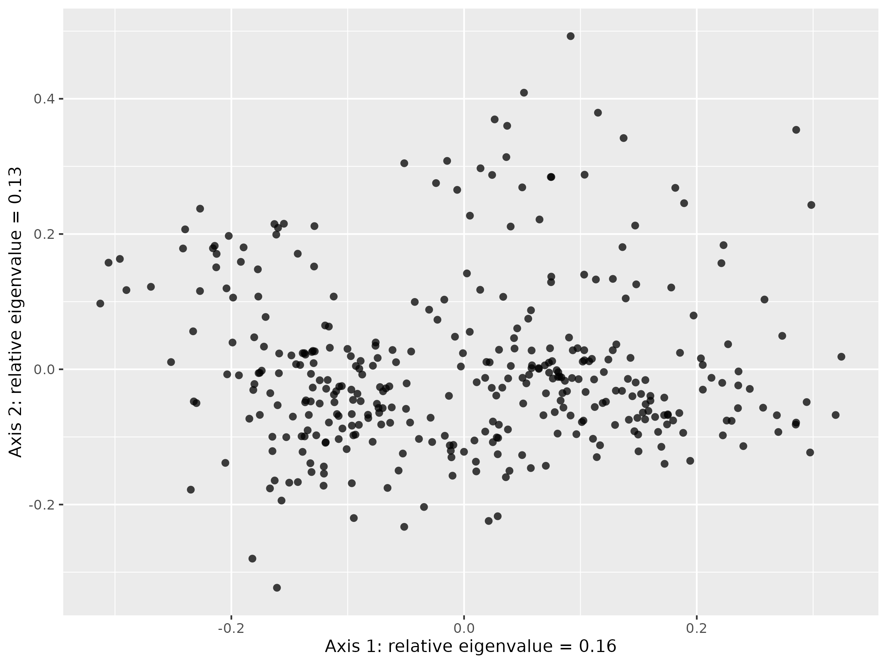

<!-- README.md is generated from README.Rmd. Please edit that file -->

# divers-tree

### Content

This repository is structured as follow:

-   [`data/`](https://github.com/mvallejo6/divers-tree/tree/master/data):
    contains all raw data required to perform analyses

-   [`rscripts/`](https://github.com/mvallejo6/divers-tree/tree/master/rscripts/):
    contains R scripts to run each step of the workflow

-   [`outputs/`](https://github.com/mvallejo6/divers-tree/tree/master/outputs):
    contains all the results created during the workflow

-   [`figures/`](https://github.com/mvallejo6/divers-tree/tree/master/figures):
    contains all the figures created during the workflow

-   [`paper/`](https://github.com/mvallejo6/divers-tree/tree/master/paper):
    contains all the manuscript and related content (biblio, templates,
    etc.)

-   [`R/`](https://github.com/mvallejo6/divers-tree/tree/master/R):
    contains R functions developed especially for this project

-   [`man/`](https://github.com/mvallejo6/divers-tree/tree/master/man):
    contains help files of R functions

-   [`DESCRIPTION`](https://github.com/mvallejo6/divers-tree/tree/master/DESCRIPTION):
    contains project metadata (author, date, dependencies, etc.)

-   [`make.R`](https://github.com/mvallejo6/divers-tree/tree/master/make.R):
    master R script to run the entire project by calling each R script
    stored in the `rscripts/` folder

## To do:

-   How many polymorphisms per each trait (old and new)
-   What are unique states/state combinations per trait
-   what each analysis is doing in readme
-   implement the ordinal traits: (1) to take into account
    polymorphy, (2) to start with ‘old’ PROTEUS traits and order them
    based on what’s in the data, including polymorphisms

## Notes

-   Don’t impute missing data that is missing for a natural reason

-   Hypervolumes to deal with complex trait spaces :
    <https://www.pnas.org/doi/10.1073/pnas.1317722111>

-   phylo PCA does not work well :
    <https://academic.oup.com/sysbio/article/64/4/677/1649888>

-   ASR coevolution :
    <https://www.biorxiv.org/content/10.1101/2021.09.03.458928v2.full.pdf+html>

-   Pagel made the “best model” :
    <https://www.nature.com/articles/s41467-022-28595-z>

-   Macroevolution and function traits in birds
    <https://www.nature.com/articles/s41559-019-1070-4>

-   Suggested at FREE workshop that ordinal vars generally give better
    trait space quality so try to use those

-   Functional distance between some species is equal to 0. You can
    choose to gather species into Functional Entities gathering species
    with similar traits values.

-   If things are bright/whitish and dull, delete dull

Using mfd to compare trait spaces

-   Are dimorphic species functionally less diverse than monomorphic
    species
-   Are reproductive strategies of trees more diverse than those of
    herbs?

This would involve removing e.g. reproductive traits or woodiness from
the dataset, but would we also have to remove correlated traits like
tree height?

-   Look for unexpected correlations

-   What about the gaps in trait space? where are dimorphic species
    lacking?

## Workflow

### 1\_proteus\_data\_preparation\_discrete.R

Reads in raw PROTEUS data for all traits, then outputs a
[table](https://github.com/mvallejo6/divers-tree/tree/master/outputs/all_states_per_trait.csv)
of all states for each trait of interest. These are used to build the
trait\_recoding table
(<https://docs.google.com/spreadsheets/d/14ITGqVvyfYeVSVSzbrWe9eUWF4NXO7cZvtZDk5mlTW0/edit?usp=sharing>),
which is then reread into the script. The
[trait\_recoding](https://github.com/mvallejo6/divers-tree/tree/master/data/trait_recoding%20-%20Categorical%20to%20categorical.csv)
table is then used to transform old PROTEUS states into new states that
are more appropriate for analysis (in terms of reducing complexity or by
making them more biologically interpretable). If traits are polymporphic
for a species e.g. PROTEUS provides information indicating a species can
be both woody and herbaceous this is coded by pasting the states
together with an underscore (‘woody\_herbaceous’).

| trait\_number | old\_trait | old\_state         | old\_state\_freq | new\_trait | new\_state |
|--------------:|:-----------|:-------------------|-----------------:|:-----------|:-----------|
|             1 | Habit (D1) | \(0\) tree         |              109 | Woodiness  | woody      |
|             1 | Habit (D1) | \(1\) shrub        |               89 | Woodiness  | woody      |
|             1 | Habit (D1) | \(2\) liana        |                7 | Woodiness  | woody      |
|             1 | Habit (D1) | \(3\) herb         |              141 | Woodiness  | herbaceous |
|             1 | Habit (D1) | \(4\) vine         |               11 | Woodiness  | herbaceous |
|             1 | Habit (D1) | \(5\) aquatic herb |               26 | Woodiness  | herbaceous |

### 2\_proteus\_data\_preparation\_quant.R

Reads in the same PROTEUS data as script 1 but this time prepares
quantitative data for analysis. Values for quantitative traits found in
PROTEUS are presented as data values (ValDat), data minimum values
(MinDat) and data maximum values (MaxDat). As there may be multiple
values per species, an average is taken for each of these data value
types. If ValDat is present, this is used preferentially. If it is not
present then the average of the averages of MaxDat and MinDat is used. A
[table](https://github.com/mvallejo6/divers-tree/tree/master/outputs/proteus_quantitative.csv)
with a single value per species is then exported.

### 3\_recode\_quantitative\_discrete.R

Converts quantitative variables to discrete ones. Values for outcrossing
rates were converted from quantitative to discrete. If all rate values
(MinDat, MaxDat, ValDat) were greater than 0.8 then the species was
assigned ‘outcrossing’. Likewise, if all rate values were less than 0.2
the species was assigned ‘selfing’. Otherwise the species was classified
as ‘mixed’. Min and Max values were preferrentially used for assignment
if available, if not the ValDat was used. This produces a
[table](./outputs/proteus_quant_recoded.csv) of discrete states.

### 4\_merge\_subset\_data.R

Combines discrete, quantitative and discretized data into one data
frame. Two sources of outcrossing information are present (‘Mating’ for
the discrete assignment, ‘outcrossing\_rate’ for the discretized
assignment) and the discretized assignment is used preferentially if
available. If Mating was polymorphic for a species
(e.g. ‘selfing\_mixed’) then it is recoded to ‘mixed’. A new trait
‘flowerSize’ is made from the maximum value of flowerLength and
flowerDiameter, which are then removed. A final
[table](https://github.com/mvallejo6/divers-tree/tree/master/outputs/proteus_combined.csv)
is output for downstream analysis.

### 5\_clean\_filter\_df.R

The amount of missing data in the dataset is visualized with a
missingness plot.

<figure>
<figcaption aria-hidden="true">Fig. Missingness plot showing the missing data per trait in black.</figcaption>
</figure>

The dataset is then filtered, removing traits with more than 60% missing
data and species with more than 50% missing data. Outliers for each of
the traits are also removed and the data is saved as an
[RDS](https://github.com/mvallejo6/divers-tree/tree/master/outputs/df_filt.rds).

### 6\_scale\_transform.R

The dataset is read in and scaled, histograms of the variables for each
trait are
[plotted](https://github.com/mvallejo6/divers-tree/tree/master/figures/proteus_trait_hists.pdf)
and
[log-transformed](https://github.com/mvallejo6/divers-tree/tree/master/figures/proteus_trait_hists_transformed.pdf)
if appropriate. The data is saved as an
[RDS](https://github.com/mvallejo6/divers-tree/tree/master/outputs/df_filt_trans.rds).

|                      | Numberoffertilestamens | Numberofovulesperfunctionalcarpel | Numberofstructuralcarpels | Fusionofovaries | Maximumverticalheight | flowerSize | Woodiness         | Climbing     | SexualSystem | Lifespan | Mating      | Pollination     | Dispersal | FlowerSex | OvaryPosition | FloralReward | FlowerSymmetry | Showiness       |
|:---------------------|-----------------------:|----------------------------------:|--------------------------:|----------------:|----------------------:|-----------:|:------------------|:-------------|:-------------|:---------|:------------|:----------------|:----------|:----------|:--------------|:-------------|:---------------|:----------------|
| Abolboda pulchella   |              -2.835736 |                         -2.389082 |                        NA |              NA |                    NA | -1.8847839 | herbaceous        | non-climbing | monomorphic  | NA       | NA          | biotic          | NA        | bisexual  | superior      | nectar       | zygomorphic    | bright          |
| Achatocarpus praecox |              -1.161760 |                         -4.749936 |                -1.0892306 |        1.079696 |                    NA | -1.8047412 | woody             | non-climbing | dimorphic    | long     | outcrossing | biotic          | biotic    | unisexual | superior      | NA           | actinomorphic  | dull\_whitish   |
| Acorus calamus       |              -2.142589 |                         -3.245859 |                -0.6837654 |        1.079696 |             -1.876996 | -2.4237804 | herbaceous        | non-climbing | monomorphic  | long     | outcrossing | biotic          | abiotic   | bisexual  | superior      | nursery      | zygomorphic    | dull\_whitish   |
| Actinidia chinensis  |               1.109076 |                         -2.041886 |                 1.5849181 |        1.079696 |                    NA |  0.2650384 | woody             | climbing     | dimorphic    | long     | outcrossing | abiotic\_biotic | NA        | unisexual | superior      | NA           | actinomorphic  | NA              |
| Aerva javanica       |              -2.324911 |                         -4.749936 |                -0.8660870 |        1.079696 |             -2.436612 | -2.9833962 | herbaceous\_woody | non-climbing | dimorphic    | long     | outcrossing | biotic          | NA        | unisexual | superior      | NA           | actinomorphic  | whitish         |
| Aextoxicon punctatum |              -2.229601 |                         -4.056789 |                -1.7823777 |              NA |                    NA | -1.5971018 | woody             | non-climbing | dimorphic    | long     | outcrossing | biotic          | biotic    | unisexual | superior      | NA           | actinomorphic  | bright\_whitish |

### 7\_correlation.R

Examines the correlation between traits in the dataset. First Kendall’s
[distance](https://en.wikipedia.org/wiki/Kendall_tau_distance) (a ranked
metric) is calculated pairwise among each trait. Traits are plotted
pairwise to examine their relationships visually. \[DESCRIBE\]

<figure>
<figcaption aria-hidden="true">Fig. Pairwise relationships between different traits</figcaption>
</figure>

Gower’s
[distance](https://medium.com/analytics-vidhya/gowers-distance-899f9c4bd553)
is calculated among species as it can deal with quantitative,
qualitative and missing trait data.

<figure>
<figcaption aria-hidden="true">Fig. Visualization of gower distances where red means closer and blue further away</figcaption>
</figure>

### 8\_pcoa.R

Principal coordinate analysis
([PCOA](https://en.wikipedia.org/wiki/Multidimensional_scaling#Types))
based on Gower’s distances previously calculated. Here are all species
displayed on the first two PCOA axes.

<figure>
<figcaption aria-hidden="true">Fig. Scatterplot of PCOA where each point indicates a species.</figcaption>
</figure>

The relative eigenvalues indicate the proportion of variation each axis
explains.

<figure>
<figcaption aria-hidden="true">Fig. Relative eigenvalues of each PCOA axis.</figcaption>
</figure>

The PCOA can also be plotted alongside different traits.

<figure>
<figcaption aria-hidden="true">Fig. PCOA scatterplots filled with different traits.</figcaption>
</figure>

The script
[8.1\_pcoa\_no\_reproductive.R](https://github.com/mvallejo6/divers-tree/tree/master/rscripts/8.1_pcoa_no_reproductive.R)
repeats the same PCOA but builds the trait space without reproductive
traits (‘Mating’,‘SexualSystem’,‘FlowerSex’). This can then be plotted
and coloured by the reproductive traits that were removed to see how
they are distributed in the trait space.

<figure>
<figcaption aria-hidden="true">Fig. PCOA scatterplots constructed without reproductive traits but coloured with them.</figcaption>
</figure>

### 9\_clustering\_hierarchical.R

This script is based on an online
[tutorial](https://towardsdatascience.com/hierarchical-clustering-on-categorical-data-in-r-a27e578f2995)
that uses the hierarchical clustering approach to create clusters based
on Gower’s distances. First dendrograms are built using several
different methods including divisive and agglomerative clustering.
Within agglomerative clustering five different methods are used to
create dendrograms.

From **hclust** help: *Ward’s minimum variance method aims at finding
compact, spherical clusters. The complete linkage method finds similar
clusters. The single linkage method (which is closely related to the
minimal spanning tree) adopts a ‘friends of friends’ clustering
strategy. The other methods can be regarded as aiming for clusters with
characteristics somewhere between the single and complete link methods.*

<figure>
<figcaption aria-hidden="true">Fig. Dendogram made from the Ward.d2 method of clustering</figcaption>
</figure>

To understand the appropriate number of clusters for the data and
method, a [helper
script](https://github.com/mvallejo6/divers-tree/tree/master/R/cstats.table.R)
is used to provide some statistics about the qualities of different
clusters, up to seven.

| X                 | Test.1 | Test.2 | Test.3 | Test.4 | Test.5 | Test.6 | Test.7 | Test.8 | Test.9 |
|:------------------|-------:|-------:|-------:|-------:|-------:|-------:|-------:|-------:|-------:|
| cluster.number    |   2.00 |   3.00 |   4.00 |   5.00 |   6.00 |   7.00 |   8.00 |   9.00 |  10.00 |
| n                 | 328.00 | 328.00 | 328.00 | 328.00 | 328.00 | 328.00 | 328.00 | 328.00 | 328.00 |
| within.cluster.ss |  18.45 |  15.14 |  13.72 |  12.73 |  11.87 |  11.31 |  10.78 |  10.30 |   9.89 |
| average.within    |   0.31 |   0.28 |   0.26 |   0.25 |   0.24 |   0.24 |   0.23 |   0.23 |   0.22 |
| average.between   |   0.44 |   0.41 |   0.40 |   0.40 |   0.39 |   0.39 |   0.39 |   0.39 |   0.39 |
| wb.ratio          |   0.71 |   0.68 |   0.65 |   0.63 |   0.61 |   0.60 |   0.59 |   0.58 |   0.57 |
| dunn2             |   1.38 |   1.19 |   0.99 |   0.95 |   0.84 |   0.88 |   0.95 |   0.99 |   0.87 |
| avg.silwidth      |   0.28 |   0.23 |   0.24 |   0.23 |   0.22 |   0.23 |   0.23 |   0.24 |   0.21 |
| Cluster- 1 size   | 232.00 | 133.00 | 133.00 |  97.00 |  34.00 |  34.00 |  34.00 |  34.00 |  34.00 |
| Cluster- 2 size   |  96.00 |  96.00 |  55.00 |  55.00 |  55.00 |  55.00 |  55.00 |  55.00 |  55.00 |
| Cluster- 3 size   |   0.00 |  99.00 |  41.00 |  41.00 |  41.00 |  14.00 |  14.00 |  14.00 |  14.00 |
| Cluster- 4 size   |   0.00 |   0.00 |  99.00 |  99.00 |  99.00 |  27.00 |  16.00 |  16.00 |  16.00 |
| Cluster- 5 size   |   0.00 |   0.00 |   0.00 |  36.00 |  63.00 |  99.00 |  99.00 |  99.00 |  99.00 |
| Cluster- 6 size   |   0.00 |   0.00 |   0.00 |   0.00 |  36.00 |  63.00 |  11.00 |  11.00 |  11.00 |
| Cluster- 7 size   |   0.00 |   0.00 |   0.00 |   0.00 |   0.00 |  36.00 |  63.00 |  63.00 |  13.00 |
| Cluster- 8 size   |   0.00 |   0.00 |   0.00 |   0.00 |   0.00 |   0.00 |  36.00 |  20.00 |  20.00 |
| Cluster- 9 size   |   0.00 |   0.00 |   0.00 |   0.00 |   0.00 |   0.00 |   0.00 |  16.00 |  50.00 |
| Cluster- 10 size  |   0.00 |   0.00 |   0.00 |   0.00 |   0.00 |   0.00 |   0.00 |   0.00 |  16.00 |

‘within.cluster.ss’ or within-cluster sum of squares is a measure of
closeness of observations : the lower it is the closer the observations
within the clusters are — changes for the different number of clusters.

‘average.within’ is an average distance among observations within
clusters ‘average.between’ is an average distance among observations
between clusters ‘wb.ratio’ is the ratio between these two averages.

‘dunn2’ is the dunn index, which can be
[interpreted](https://www.datanovia.com/en/lessons/cluster-validation-statistics-must-know-methods/#silhouette-coefficient)
as follows: If the data set contains compact and well-separated
clusters, the diameter of the clusters is expected to be small and the
distance between the clusters is expected to be large. Thus, Dunn index
should be maximized.

‘avg.silwidth’ can be
[defined](https://www.datanovia.com/en/lessons/cluster-validation-statistics-must-know-methods/#silhouette-coefficient)
as follows: Observations with a large values (almost 1) are very well
clustered, small (around 0) means that the observation lies between two
clusters. Observations with a negative Si are probably placed in the
wrong cluster. The average is taken across all observations (species) in
each cluster.

The remaining rows indicate the number of species in each cluster, this
shouldn’t be too skewed ideally. The Ward method (table presented above)
provides the best *within.cluster.ss* and a relatively even distribution
of cluster sizes compared to other methods so we proceed with this
approach.

Then the appropriate number of clusters must be chosen using these
statistics. The elbow method examines how a statistic changes with the
number of clusters, looking for when adding more clusters stops
substantially improving the clustering. In this case it is quite
difficult to identify the elbow, perhaps three or six clusters are the
most appropriate.

<figure>
<figcaption aria-hidden="true">Fig. Within cluster sum of squares for increasing numbers of clusters.</figcaption>
</figure>

Silhouette width can also be used in a similar way, but seems to prefer
two clusters in most situations so is perhaps less reliable.

<!-- .element height="50%" width="50%" -->

Once a number of clusters can be selected this can be visualised on the
dendrogram.

Fig. Ward dendrogram coloured by clusters (k = 3 and k = 6)

We can then examine the trait states and values that make up each
cluster.

<figure>
<figcaption aria-hidden="true">Fig. The relative proportion for qualitative traits across clusters (k = 3)</figcaption>
</figure>

Fig. Values of quantitative traits across clusters (k = 3)

-   Cluster 1 is made up of small herbaceous, monomorphic (and bisexual)
    species with large, bright flowers. Species examples include
    *Curcurbita pepo*, *Geranium sanguineum* and *Nicotiana tabacum*.

-   Cluster 2 contains species that are long lived, biotically
    pollinated outcrossers that are unisexual and actinomorphic. Their
    flowers tend to be small with low numbers of ovules per functional
    carpel. Species examples include *Allium sativum*, *Populus alba*
    and *Amborella trichopoda*.

-   Cluster 3 harbors species that are woody, monomorphic (and bisexual)
    that are tall with large flowers containing many fertile stamens.
    Species examples include *Viburnum rufidulum*, *Coffea arabica* and
    *Ravenala madagascariensis*.

We can then represent the identified clusters on the PCOA trait space.

Fig. PCOA plot coloured by clusters (k = 3)

Six clusters was also an option but when visualized in the 2d trait
space they seem less neat.

Fig. PCOA plot coloured by clusters (k = 6)

### 9.1\_clustering\_kprototype.R

Other methods that can deal with mixed and missing data include
[kprototypes](https://journal.r-project.org/archive/2018/RJ-2018-048/RJ-2018-048.pdf),
which yields results similar to hierarchical clustering.

Fig. PCOA plot coloured by clusters from the kprototypes approach (k =
4)

### 9.2\_clustering\_PAM.R

Likewise the [Partitioning Around
Medoids](https://dpmartin42.github.io/posts/r/cluster-mixed-types) (PAM)
approach also found similar clustering.

Fig. PCOA plot coloured by clusters from the PAM approach (k = 3)

### 9.3\_clustering\_LCM.R

Another potential approach is [model-based
clustering](https://varsellcm.r-forge.r-project.org/) but this generated
results quite different to the others. Perhaps due to a more dominant
influence of quantitative characters.

Fig. PCOA plot coloured by clusters from model-based clustering (k = 3)

## Other scripts

### discrete\_state\_freqs.R

The number of species with each discrete state (original) from the
PROTEUS dataset.
