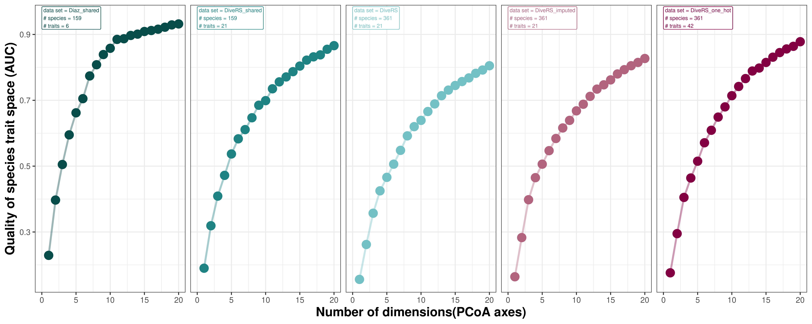
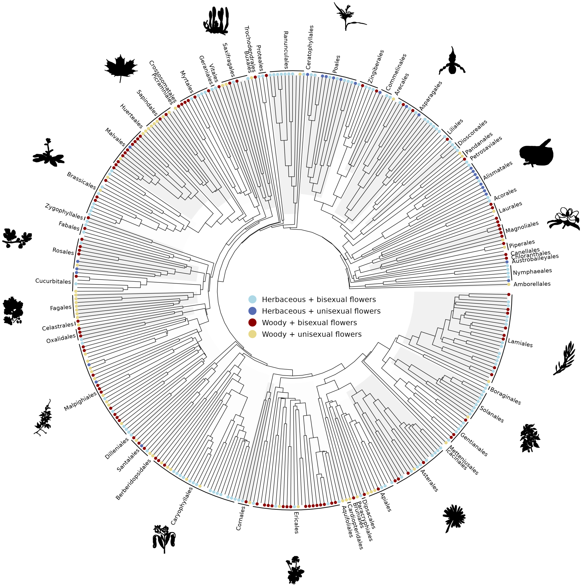
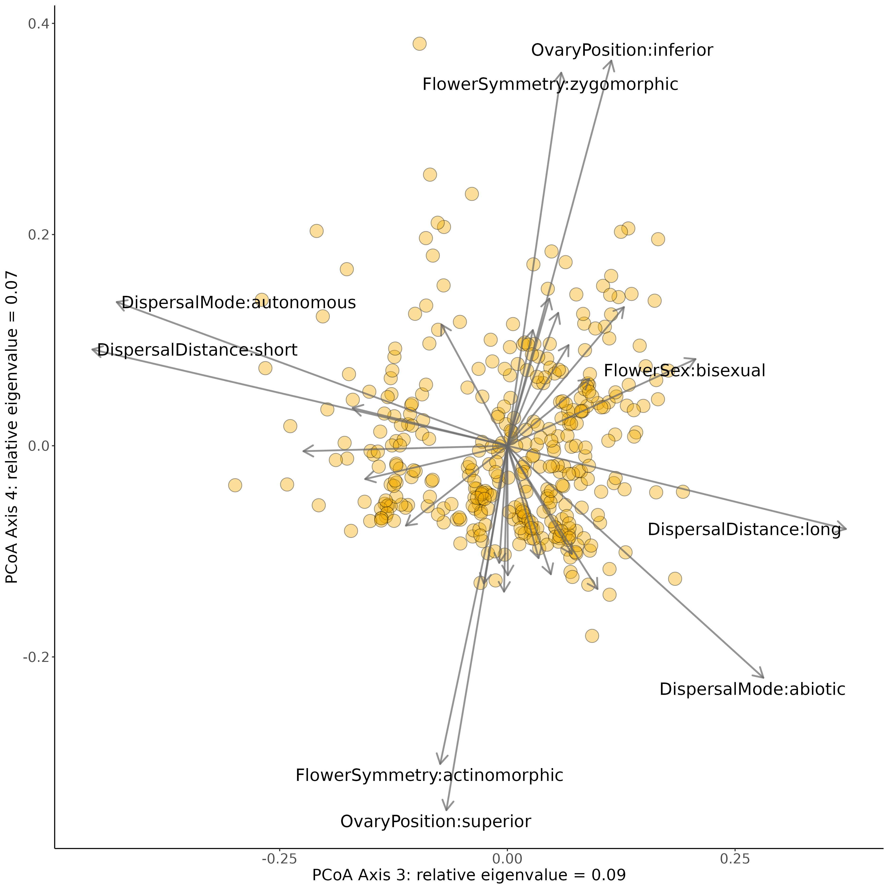
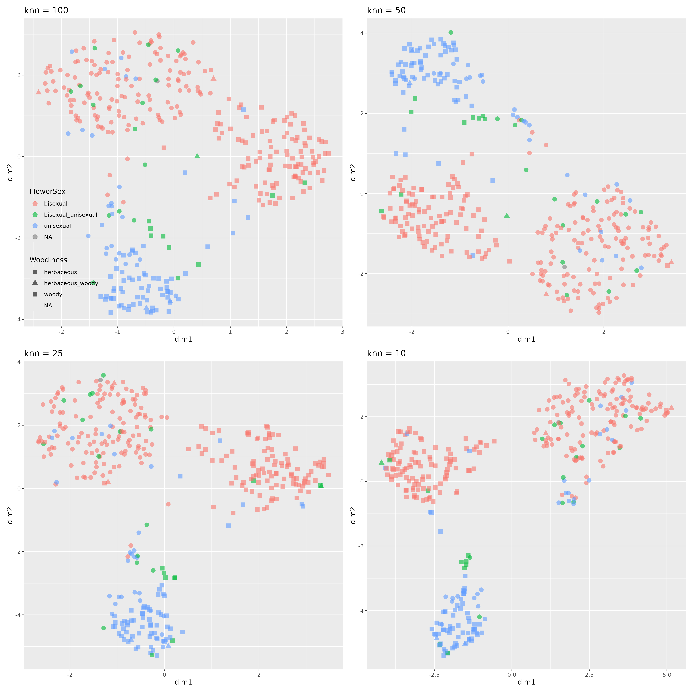

<!-- README.md is generated from README.Rmd. Please edit that file -->

# Rcompendium for: *An angiosperm-wide perspective on reproductive strategies and floral traits*

A preprint of this study can be found
[here](https://doi.org/10.1101/2024.02.26.582019)

### Content

This repository is structured as follow:

- [`data/`](https://github.com/divers-it/rs-traitspace/tree/main/data):
  contains all raw data required to perform analyses

- [`rscripts/`](https://github.com/divers-it/rs-traitspace/tree/main/rscripts/):
  contains R scripts to run each step of the workflow

- [`outputs/`](https://github.com/divers-it/rs-traitspace/tree/main/outputs):
  contains all the results created during the workflow

- [`figures/`](https://github.com/divers-it/rs-traitspace/tree/main/figures):
  contains all the figures created during the workflow

- [`paper/`](https://github.com/divers-it/rs-traitspace/tree/main/paper):
  contains manuscript related content (biblio, templates, etc.)

- [`R/`](https://github.com/divers-it/rs-traitspace/tree/main/R):
  contains R functions used in this project

- [`man/`](https://github.com/divers-it/rs-traitspace/tree/main/man):
  contains help files of R functions

- [`DESCRIPTION`](https://github.com/divers-it/rs-traitspace/tree/main/DESCRIPTION):
  contains project metadata (author, date, dependencies, etc.)

- [`make.R`](https://github.com/divers-it/rs-traitspace/tree/main/make.R):
  master R script to run the entire project by calling each R script
  stored in the `rscripts/` folder

## Workflow

Note that there are two encodings that are used for these data. The
original encoding has traits with as many values as there are states
(e.g. woody, herbaceous, woody_herbaceous). For the one-hot encoding,
each state is recoded to a binary trait (e.g. trait 1: woody, non-woody
\| trait 2: herbaceous, non-herbaceous). Scripts 1, 3, 4, 5 and 6 have
corresponding one-hot encoding versions with the suffix “one_hot”.

#### 1_proteus_data_preparation_discrete.R

Reads in raw PROTEUS data for all traits, then outputs a
[table](https://github.com/divers-it/rs-traitspace/tree/main/outputs/all_states_per_trait.csv)
of all states for each trait of interest. These are used to build the
trait_recoding table, which is then reread into the script. The
[trait_recoding](https://github.com/divers-it/rs-traitspace/tree/main/data/trait_recoding%20-%20Categorical%20to%20categorical.csv)
table is then used to transform old PROTEUS states into new states that
are more appropriate for analysis (in terms of reducing complexity or by
making them more biologically interpretable). If traits are polymporphic
for a species e.g. PROTEUS provides information indicating a species can
be both woody and herbaceous this is coded by pasting the states
together with an underscore (‘woody_herbaceous’).

| trait_number | old_trait | old_state | old_state_freq | new_trait | new_state |
|---:|:---|:---|---:|:---|:---|
| 1 | Habit (D1) | \(0\) tree | 109 | Woodiness | woody |
| 1 | Habit (D1) | \(1\) shrub | 89 | Woodiness | woody |
| 1 | Habit (D1) | \(2\) liana | 7 | Woodiness | woody |
| 1 | Habit (D1) | \(3\) herb | 141 | Woodiness | herbaceous |
| 1 | Habit (D1) | \(4\) vine | 11 | Woodiness | herbaceous |
| 1 | Habit (D1) | \(5\) aquatic herb | 26 | Woodiness | herbaceous |

#### 2_proteus_data_preparation_quant.R

Reads in the same PROTEUS data as script 1 but this time prepares
quantitative data for analysis. Values for quantitative traits found in
PROTEUS are presented as data values (ValDat), data minimum values
(MinDat) and data maximum values (MaxDat). As there may be multiple
values per species, an average is taken for each of these data value
types. If ValDat is present, this is used preferentially. If it is not
present then the average of the averages of MaxDat and MinDat is used. A
table with a single value per species is then exported.

#### 3_recode_quantitative_discrete.R

Converts quantitative variables to discrete ones. Values for outcrossing
rates were converted from quantitative to discrete. If all rate values
(MinDat, MaxDat, ValDat) were greater than 0.8 then the species was
assigned ‘outcrossing’. Likewise, if all rate values were less than 0.2
the species was assigned ‘selfing’. Otherwise the species was classified
as ‘mixed’. Min and Max values were preferrentially used for assignment
if available, if not the ValDat was used. This produces a table of
discrete states.

#### 4_merge_subset_data.R

Combines discrete, quantitative and discretized data into one data
frame. Two sources of outcrossing information are present (‘Mating’ for
the discrete assignment, ‘outcrossing_rate’ for the discretized
assignment) and the discretized assignment is used preferentially if
available. If Mating was polymorphic for a species
(e.g. ‘selfing_mixed’) then it is recoded to ‘mixed’. A new trait
‘flowerSize’ is made from the maximum value of flowerLength and
flowerDiameter, which are then removed. A final table is output for
downstream analysis.

#### 5_clean_filter_df.R

The dataset is then filtered, removing traits with more than 60% missing
data and species with more than 50% missing data. Outliers for each of
the traits are also removed and the data is saved as an RDS. Species
names are also checked and corrected in this script.

<figure>

<figcaption aria-hidden="true"><strong>Figure S1</strong> Missingness
plot showing the missing data per trait in black.</figcaption>
</figure>

#### 6_scale_transform.R

The data set is read in and scaled, histograms of the variables for each
trait are plotted and log-transformed if appropriate. The data is saved
as an RDS.

|  | Maximumverticalheight | Numberoffertilestamens | Numberofovulesperfunctionalcarpel | Numberofstructuralcarpels | Fusionofovaries | flowerSize | seedMass | Woodiness | Climbing | Aquatic | SexualSystem | Lifespan | Mating | Pollination | DispersalMode | DispersalDist | FlowerSex | OvaryPosition | FloralReward | FlowerSymmetry | Showiness |
|:---|---:|---:|---:|---:|---:|---:|---:|:---|:---|:---|:---|:---|:---|:---|:---|:---|:---|:---|:---|:---|:---|
| Abolboda pulchella | -1.0638623 | -0.8576644 | 0.6266987 | NA | NA | -0.6636378 | NA | herbaceous | non-climbing | non-aquatic | monomorphic | long | NA | biotic | NA | NA | bisexual | superior | nectar | zygomorphic | bright |
| Achatocarpus praecox | 0.6679568 | 0.7403689 | -0.7844397 | -0.5701386 | 0.4104134 | -0.5945311 | NA | woody | non-climbing | non-aquatic | dimorphic | long | outcrossing | biotic | biotic | long | unisexual | superior | NA | actinomorphic | bright_dull |
| Acorus calamus | -0.0443398 | -0.1959632 | 0.1145830 | 0.0384931 | 0.4104134 | -1.1289928 | -0.1207739 | herbaceous | non-climbing | non-aquatic | monomorphic | long | outcrossing | biotic | abiotic | long | bisexual | superior | other | zygomorphic | bright_dull |
| Actinidia chinensis | 0.5625575 | 2.9081846 | 0.8342261 | 3.4439469 | 0.4104134 | 1.1924606 | -0.3673656 | woody | climbing | non-aquatic | dimorphic | long | outcrossing | abiotic_biotic | biotic | long | unisexual | superior | none_pollen | actinomorphic | bright |
| Aerva javanica | -0.3678511 | -0.3700134 | -0.7844397 | -0.2351844 | 0.4104134 | -1.6121499 | -0.8665225 | herbaceous_woody | non-climbing | non-aquatic | dimorphic | long | outcrossing | biotic | abiotic | long | unisexual | superior | NA | actinomorphic | bright |
| Aextoxicon punctatum | 0.8342645 | -0.2790271 | -0.3701292 | -1.6106013 | NA | -0.4152609 | 1.1859153 | woody | non-climbing | non-aquatic | dimorphic | long | outcrossing | biotic | biotic | long | unisexual | superior | NA | actinomorphic | bright |

#### 7_correlation.R

Examines the correlation between traits in the data set and clusters
traits into groups (Fig. 3b).

<figure>

<figcaption aria-hidden="true"><strong>Figure 2</strong>. (a) One-hot
traitspace with eigenvectors and (b) trait correlation matrix with
dendrogram.</figcaption>
</figure>

#### 8.0_pcoa.R

Gower’s
[distance](https://medium.com/analytics-vidhya/gowers-distance-899f9c4bd553)
is calculated among species as it can deal with quantitative,
qualitative and missing trait data.

Principal coordinate analysis
([PCOA](https://en.wikipedia.org/wiki/Multidimensional_scaling#Types))
based on Gower’s distances previously calculated. Here are all species
displayed on the first two PCOA axes.

<figure>

<figcaption aria-hidden="true"><strong>Figure 4.</strong> Scatterplot of
PCOA where each point indicates a species.</figcaption>
</figure>

#### 8.1_pcoa_diaz_data.R

We examined to locations of our species in the trait space derived from
classical plant functional traits [Diaz et
al. 2022](https://doi.org/10.1038/s41597-022-01774-9), and compared the
quality of these trait spaces.

<figure>

<figcaption aria-hidden="true"><strong>Figure S3</strong>. Diaz et
al. 2022 comparison.</figcaption>
</figure>

#### 9_dimensionality_analyses.R

To get an idea of the quality of the trait space, analyses from
[Mouillot & Loiseau et
al. 2021](https://onlinelibrary.wiley.com/doi/abs/10.1111/ele.13778)
were run: *To assess the dimensionality and robustness of species trait
spaces, we needed a metric measuring the degree of distortion between
the initial trait distance matrix between species pairs (Gower distance
on all traits) and the distance matrix after dimensionality reduction
(Euclidean distance on PCoA axes) or after removing traits (Gower
distance on the sub-selection of traits), respectively. We assumed that
a trait space is a high- quality representation of the full dataset if
distances between species in that space are close to the initial
distances computed with all traits (Maire et al., 2015).*

The plot below shows how the quality of the trait space increases as
dimensions or PCoA axes are added. The elbow technique is used to show
where adding more axes starts having less of an effect on trait space
quality. This is quite early for our dataset, around 0.4 AUC suggesting
that these do not adequately represent the original trait space and more
axes are needed to do so. The dataset does pass the AUC threshold of 0.7
within 20 axes indicating that when a larger number of axes are
considered the reduced trait space is a good representation.

<figure>

<figcaption aria-hidden="true"><strong>Figure S5</strong>. Influence of
number of dimensions on the quality of trait space.</figcaption>
</figure>

#### 10_clustering_PAM.R

The [Partitioning Around
Medoids](https://dpmartin42.github.io/posts/r/cluster-mixed-types) (PAM)
approach is used. All species must be assigned to a cluster and some
species may be spuriously assigned to clusters. Examples of cluster
membership when number of clusters (k) is 2 and 3 is shown in Figure 4a.

<figure>

<figcaption aria-hidden="true"><strong>Figure 3</strong>. Panel (a)
shows PCoA with clustering where colours (k = 2) and shapes (k = 3)
correspond to PAM clusters. Panel (b) shows UMAP plot see below) where
shapes correspond to k = 3 clusters.</figcaption>
</figure>

To avoid interpreting species than are not well-clustering we look at
‘robust groups’ - those species that consistently stick together as the
value of k is changed. A Sankey plot demonstrates how species move
between clusters as k is increased.

<figure>

<figcaption aria-hidden="true"><strong>Figure S11</strong>. A Sankey
plot representing how species are shared among clusters when values of k
are increased from 2-7.</figcaption>
</figure>

We can then visualize how these robust groups relate to clusters, and
also how traits differ among robust groups.

<figure>

<figcaption aria-hidden="true"><strong>Figure S12</strong>. Robust
groups from PAM clustering and corresponding state frequences / trait
values.</figcaption>
</figure>

#### 11_phylo_plot

Plots a phylogenetic tree of all 360 species in our data set with trait
data at the tips.

<figure>

<figcaption aria-hidden="true"><strong>Figure 1</strong>. Phylogenetic
tree.</figcaption>
</figure>

#### 12_loadings.R

Builds a traitspace using one-hot encoded data. Eigenvectors are plotted
on the first two axes, similar to ‘loadings’ from a PCA biplot, as shown
in Figure 3a.

<figure>

<figcaption aria-hidden="true"><strong>Figure 2</strong>. (a) One-hot
traitspace with eigenvectors and (b) trait correlation matrix with
dendrogram.</figcaption>
</figure>

We can also examine other axes to see which traits vary along them.

<figure>

<figcaption aria-hidden="true"><strong>Figure S7</strong>. One-hot
traitspace with eigenvectors for axes 3 and 4.</figcaption>
</figure>

#### 13_UMAP.R

Performs Uniform Manifold Approximation and Projection (UMAP), a
non-linear dimensionality reduction approach.

<figure>

<figcaption aria-hidden="true"><strong>Figure S10</strong>. UMAP trait
spaces with different values of neighbourhood size.</figcaption>
</figure>

Also systematically plots all traits on
[`umap`](https://github.com/divers-it/rs-traitspace/tree/main/figures/umap)
and
[`pcoa`](https://github.com/divers-it/rs-traitspace/tree/main/figures/pcoa)
trait spaces.

#### 14_simulations.R

Fits models of trait evolution to each trait, and then uses these along
phylogenetic trees to simulate 1000 data sets. PCoA is run on these
simulated data sets and results are compared to empirical ones.

<figure>

<figcaption aria-hidden="true"><strong>Figure S6</strong>. Comparison of
simulated (black error bars) versus empirical (coloured lines)
eigenvalues.</figcaption>
</figure>

## Utility scripts

#### generate_phylo.R

Builds phylogenetic tree using our species list.

#### get_taxonomy.R

Searches species names against the world checklist of vascular plants,
and corrections are made where necessary.

#### impute_missing_data.R

Uses random forests and the phylogenetic tree to infer missing data.

### NOT_USED

Contains scripts that are not used in the current version of the
manuscript (but could be useful in the future).
